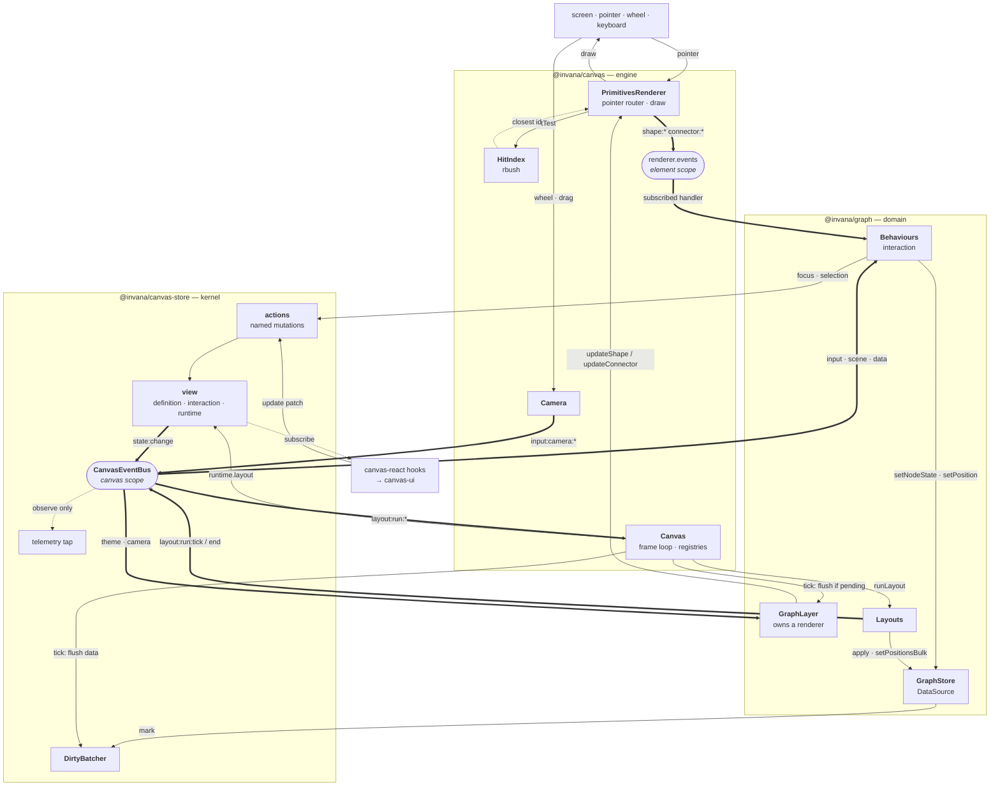
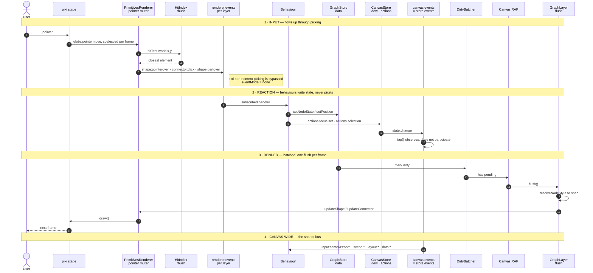

# design.md — code-structure ontology

**What this is.** A high-level map of the API expressed as the shape of the code: what
folders exist, what each one owns, and how responsibility flows between them. No
implementation detail, no snippets — a navigation aid and the place to reason about
structural design decisions.

> Repo convention puts design notes in `docs/`. This lives at the root by request.

---

## 1. The dependency spine

Dependencies point in one direction only. Nothing below reaches up.

```
                    ┌──────────────────────┐
                    │   canvas-designer    │  authoring — node templates today
                    │  templates · studio  │  layout/behaviour designers planned
                    └──────────┬───────────┘
                               │
                    ┌──────────▼───────────┐
                    │   @invana/canvas-ui  │  the React UI kit — every pixel
                    │  panels · toolbars   │  editors · menus · GraphCanvasApp
                    └──────────┬───────────┘
                               │
                    ┌──────────▼───────────┐
                    │ @invana/canvas-react │  headless React bindings
                    │  roots · hooks       │  renders no UI of its own
                    └──────────┬───────────┘
                               │
   graph-layout-*  ────────────┤
   d3-force · elkjs            │
   d3-hierarchy · d3-sankey    │
   geometric                   │
                               │
   graph-layer-*   ────────────┤
   d3-contour · bubble-sets    │
   maplibre                    │
                               │
                    ┌──────────▼───────────┐
                    │    @invana/graph     │  the domain — nodes, edges, groups
                    │  GraphLayer · store  │  the interaction behaviours
                    └──────────┬───────────┘   70 files · ~20.3k LOC · zero pixi
                               │
                    ┌──────────▼───────────┐
                    │    @invana/canvas    │  the engine — Layer / Behaviour / Layout
                    │  PrimitivesRenderer  │  the only package importing pixi *
                    └──────────┬───────────┘   118 files · ~23.7k LOC
                               │
                    ┌──────────▼───────────┐
                    │ @invana/canvas-store │  the kernel — state + events + telemetry
                    │  view · data · bus   │  renderer-free, zero @invana deps
                    └──────────────────────┘   31 files · ~3.6k LOC

                    * aspirational — see §7.3
```

Three packages carry the engine — kernel, engine, domain. Everything else hangs off them:
layout and overlay-layer packages peer on `canvas` (+ `graph`), `canvas-react` binds them to
React headlessly, `canvas-ui` draws the pixels, `canvas-designer` authors templates.

---

## 2. `@invana/canvas-store` — the kernel

Owns all state and the event bus. Imports no drawing library. The engine writes to it and
subscribes from it.

| Folder | Owns | Notes |
|---|---|---|
| `view/` | the reactive state tree | three compartments: **definition** (what it IS, persisted), **interaction** (the live view, ephemeral), **runtime** (transient status, never synced) |
| `data/` | bulk data | column store, data-source contract, dirty batching, flush shape — the typed-array hot path, deliberately *not* reactive |
| `port/` | the reactive-store abstraction | store core, patching, selectors, a dependency-free reference adapter — the seam that keeps the backend swappable |
| `adapters/zustand/` | the zustand binding | the **only** file allowed to import zustand |
| `actions/` | named mutations | every write is labelled, which is what powers telemetry and history |
| `events/` | the event bus | one bus per canvas; the store is a source on it |
| `history/` | undo/redo | built on named actions |
| `telemetry/` | observability | a **port decorator**, not middleware — so it survives a backend swap |
| `renderer/` | the renderer contract | a declarative projection seam (§7.1) |
| `theme/`, `geom/`, `perf/` | shared vocabulary | theme state, geometry types, frame timing |

**The organising idea:** state is split by *sync physics*, not by feature. Small,
human-rate state is reactive and syncable; machine-rate bulk data lives in typed arrays and
never touches the reactive path.

---

## 3. `@invana/canvas` — the engine

Owns lifecycle, composition, and drawing. Two thirds of its mass is one folder.

| Folder | Files | Owns |
|---|---|---|
| `primitives/` | **77** | the entire drawing device — shapes, connectors, decorations, effects, markers, routers, path styles, anchors, painting helpers, and the renderer that ties them together |
| `engine/` | 6 | the canvas itself: lifecycle, the declarative config surface, frame metering, interaction tracking, renderer capability detection |
| `layers/` | 6 | the layer abstraction and its two bases, plus built-in layers |
| `behaviours/` | 7 | the behaviour abstraction and camera-input built-ins |
| `layouts/` | 2 | the layout abstraction and position animation |
| `registries/` | 3 | id-keyed registries for layers, behaviours, layouts |
| `export/` | 4 | image, SVG and state export/import |
| `hit/` | 1 | the spatial index used for picking |
| `instancing/` | 2 | per-element bookkeeping records ⚠️ **not** GPU instancing |
| `camera/`, `context/`, `state/`, `textures/`, `fonts/`, `theme/`, `events/` | 1–3 each | supporting services |

### 3.1 Inside `primitives/`

| Sub-area | Owns |
|---|---|
| `base/` | the abstract contracts every primitive implements |
| `shapes/` | geometry kinds, including the composite shape that backs card templates |
| `connectors/` | the connector pipeline, split into `anchors/`, `routers/`, `pathStyles/` |
| `decorations/` | additive geometry alongside a host, split `shape/` and `connector/` |
| `effects/` | modulation *of* a host (transform or style), split the same way |
| `markers/`, `badges/` | endpoint glyphs and attached plates |
| `paint/`, `animation/` | shared drawing helpers and the tween/time primitives |

**The rule that shapes this folder:** it is domain-free. Nothing here may name a node, an
edge, a table, or a lane. Domain packages compose these primitives; they never leak
vocabulary into them.

### 3.2 The three abstractions

| Abstraction | Question it answers | Registered by id |
|---|---|---|
| **Layer** | what is drawn, and in what coordinate space | yes |
| **Behaviour** | how the user interacts | yes — never auto-enabled |
| **Layout** | where things go | yes — one active at a time |

Layers split into two bases: one for camera-affected diagram content (the default), one for
content glued to screen position. The choice is decided by a single question: if the camera
pans, does this move with the diagram or stay put?

---

## 4. `@invana/graph` — the domain

Where nodes and edges finally exist as concepts.

| Folder | Files | Owns |
|---|---|---|
| `behaviours/` | **29** | the interaction vocabulary — hover, select (click/lasso/brush), drag, draw, erase, collapse/expand, context menu, centrality, parallel edges, theme, label collision, and eight level-of-detail behaviours |
| `layer/` | 4 | the graph rendering layer, the minimap, and the node/edge style vocabulary |
| `store/` | 6 | the graph data source, adjacency index, pending-edge resolution, frame flush scheduling |
| `template/` | 5 | node structure templates and the compilers that lower them to engine primitives |
| `cards/` | 8 | ready-made composite card shapes built on those templates |
| `theme/` | 6 | palettes, roles, accents, families |
| `schema/` | 3 | schema types and derivation from observed data |
| `canvas/`, `history/`, `clipboard/`, `layout/` | 1–3 each | the graph canvas facade, undo/redo, copy/paste, the one-shot layout base |

**The organising idea:** the graph package holds *meaning*. It decides that a shape is a
node and a connector is an edge; the engine below it knows only geometry.

### 4.1 The card/template stack — three separate layers

| Layer | Lives in | Owns |
|---|---|---|
| Engine primitive | `canvas/primitives/shapes/` | the composite shape — domain-free |
| Template model | `graph/template/` | structure kinds, compilers, runtime fallbacks |
| Authoring tool | `canvas-designer` | visual authoring, emits template JSON |

These are routinely conflated. When something needs changing, change it at the layer that
owns it — a template concern does not belong in the primitive, and an authoring preset does
not belong in the runtime defaults.

---

## 5. Drawing architecture

How a picture actually gets made. Two levels: the engine draws **geometry**, the domain
decides what that geometry **means**.

### 5.1 The connector pipeline — three stages

Everything about how an edge looks is decomposed into three independent, swappable stages.
This is the single most important idea in the drawing layer: no connector subclasses, just
combinations.

| Stage | Question | Built in |
|---|---|---|
| **Anchor** | where on each endpoint does the line attach? | center, boundary, perpendicular, edge-port, silhouette-port |
| **Router** | what waypoints does it travel through? | straight, orthogonal, manhattan, metro, er, one-side |
| **Path style** | how is that route drawn as a curve? | normal, rounded, bezier, quadratic, smooth, bundle, bump-radial, bump-horizontal, step-radial, loop-curve, loop-polyline |

Each stage feeds the next, and all three reduce to one common path representation — which
is why label placement, decoration anchoring, hit-testing and SVG export work uniformly
across every combination, without knowing which router produced the path.

### 5.2 Shapes

Eight geometric kinds — circle, ellipse, rect, polygon, regular-polygon, star, arc — plus
**composite**, the one that matters architecturally. A composite borrows another shape as
its silhouette and hosts child parts inside it, which is what makes card-style nodes
possible without the engine knowing what a card is.

Markers (arrowheads) are registered through the *shape* registry rather than a parallel
one, and size themselves from the host connector's stroke width, so thickening a line
rescales its arrowhead automatically.

### 5.3 Decoration vs effect vs animation — three different things

Routinely conflated; they compose.

| Concept | Definition | Adds geometry? |
|---|---|---|
| **Decoration** | drawn *alongside* a host — glow, ring, pulse, marching ants, label, toggle, resize handle, selection frame | yes |
| **Effect** | *modulates* the host itself — shake, breathing, fade-in | no; writes transform or style deltas the renderer composes |
| **Animation** | the per-frame time engine both opt into | neither; it drives them |

Both decorations and effects come in shape-hosted and connector-hosted variants, and the
renderer aggregates every contribution attached to one host before writing the result.
Animation also drives camera easing and layout settling — it is a service, not a primitive
kind.

### 5.4 How the graph layer uses all of this

The domain's job is projection: turn nodes and edges into primitive specs.

| Graph concept | Becomes |
|---|---|
| node | a shape — kind chosen by its resolved style |
| node label / badge / icon | decorations on that shape |
| edge | a connector — anchor + router + path style from its resolved style |
| edge label / arrowhead | a decoration and a marker on that connector |
| group | a shape drawn behind its members, auto-fitted to their bounds |
| collapsed group | the same shape, drawn as an ordinary interactive node with a count |
| card / template node | a composite shape, compiled from a template |

Style is resolved per element by merging layer defaults, per-element style, and any active
state overlays — in that order, field by field, with decorations concatenating rather than
replacing. The renderer never sees a template or a state name; it receives a finished spec.

### 5.5 The frame

Work is batched, never immediate. Changes mark dirty buckets; the canvas owns the single
frame loop; each layer flushes once per frame and projects only what changed. Interaction
runs the opposite way: pointer input hits a spatial index — the drawing library's own
picking is bypassed entirely — and resolves to element events that behaviours subscribe to.

### 5.6 Event flow — as built

Two buses, deliberately at different scopes. `canvas.events` **is** `store.events` — the
kernel owns the one canvas-wide bus and the engine adopts it rather than running a second.
Element-level pointer events stay on the renderer's own emitter, so a dense graph's hover
traffic never touches the global bus.

**The channels between the concepts.** Three distinct kinds of wire, and which one a
message travels on is the design decision that governs its cost.



| Wire | Notation | Scope | Cost discipline |
|---|---|---|---|
| **Element events** | thick, `renderer.events` | one layer's renderer | never reaches the canvas bus — hover traffic on a dense graph stays local |
| **Canvas events** | thick, `CanvasEventBus` | whole canvas | typed families; the store is a source on it; `tap` observes without participating |
| **Direct calls** | thin | caller → callee | writes to stores, spec updates, layout application — no pub/sub in the hot path |

Two properties fall out of the picture. **Behaviours never draw** — they write state and let
the frame loop project it. **The renderer never decides** — it receives finished specs and
paints. Every arrow into `PrimitivesRenderer` from the domain side carries a spec, never a
question.

**The frame loop, in order** — one canvas-owned tick drives everything:
camera easing → flush every data source → recompute visible bounds and cull if the camera
moved → for each visible layer by z-order, flush if it has pending work, then advance its
animations.



**Event families on the canvas-wide bus:** `scene:*` (8) · `input:*` (8) · `layout:*` (3) ·
`canvas:*` (3) · `data:*` (2) · `theme:*` · `state:*` · `render:*` · `tap:*`.

**The shape of it:** input flows *up* through picking to behaviours; changes flow *down*
through the store to a batched flush. A behaviour never draws, and the renderer never
decides. The `tap()` hook observes everything on the bus without participating — that is
how telemetry stays out of the hot path.

### 5.7 The event flow *is* the performance architecture

Read §5.6 again as a cost structure and the design intent becomes clear: **every hop is a
chokepoint that collapses many signals into few.** Nothing in the pipeline is allowed to do
per-event work.

| Hop | Discipline | Mechanism | Effect |
|---|---|---|---|
| pointer → router | **coalesce** | latest move held, resolved once per frame | hundreds of moves/sec → one resolve |
| router → pick | **index** | rbush spatial index; connectors split into arc-length boxes | candidates near the point, not a scan |
| behaviour → store | **O(1) write** | mark is a map lookup plus a set add | no steady-state allocation |
| store → frame | **dedupe** | dirty batcher, double-buffered sets | flush is a map swap; work ∝ *changed*, never scene size |
| streaming feed → frame | **coalesce** | first mutation schedules the frame, rest are no-ops | N mutations → one flush |
| frame → layers | **batch** | one canvas-owned frame loop drives every layer | one tick, not one per layer |
| zoom/scale churn | **fast path** | transform written directly, geometry untouched | avoids retrace during gestures |
| off-screen | **cull** | drawable flagged off, instance retained | skips painting without teardown |

**The top of the flow is disciplined.** Input volume, write volume and flush volume are all
bounded per frame, by construction, with an explicit performance contract at the batcher:
*per-frame consumer work is proportional to changed ids, never total scene size.*

**The bottom of the flow is not.** Three gaps, all in the final hop:

1. **Any spec change triggers a full geometry rebuild.** There is a fast path for
   transforms but none for colour, so changing only an alpha still clears and retraces the
   drawable.
2. **One drawable per element.** No batching, no GPU instancing — the per-element records
   are bookkeeping, not instancing. Scene cost is structural.
3. **The working set is the whole graph.** Viewport culling exists as a mechanism but is
   not the default posture, so off-screen elements still participate.

Measured on the reference hairball: **idle ~70 FPS, pan ~26 FPS**, with pan the worst case
and layout/drag/zoom behind it.

> **The structural insight.** Every discipline in the table above answers *"how many times
> per frame?"* — none answers *"how many things?"* The pipeline collapses **event** volume
> superbly and **element** volume not at all. That is precisely why both rendering bugs on
> record surface as O(elements) despite an O(1) event pipeline: one hover produces one
> event, which then does work proportional to the entire graph.
>
> But look closely at *which* per-element work dominates. Dimming the graph does two things
> per element: a cheap state write, and a **full geometry rebuild** behind it. The rebuild
> is the 100×; the write is noise. So the fix is not a new grouping concept — it is making
> the cheap operation actually cheap, by giving colour the same no-rebuild fast path that
> transforms already have (§7.5).
>
> Culling and batching remain the genuine element-volume levers, and both are renderer
> concerns rather than API ones.

### 5.8 What is deliberately absent

- **No per-element draw calls from outside.** Layers describe specs; the renderer decides
  when and how to paint.
- **No domain vocabulary in primitives.** The drawing layer has no concept of a node.
- **No parallel visual state.** What is drawn derives from the store, not from a cache the
  renderer maintains.
- **No batching or instancing yet.** One drawable per element — the constraint behind the
  scale work, and the reason the drawing model is the first thing to revisit for very large
  graphs.

## 6. Where the mass sits

Six files carry a third of the engine. They are the ones to know.

| File | LOC | Role |
|---|---|---|
| `canvas/primitives/PrimitivesRenderer` | 2,973 | the drawing device — every add/update/remove path |
| `graph/layer/GraphLayer` | 2,888 | the graph↔renderer projection |
| `graph/store/GraphStore` | 1,763 | the graph data source |
| `graph/layer/types` | 1,473 | the node/edge style vocabulary |
| `canvas/primitives/types` | 1,394 | the primitive spec vocabulary |
| `canvas/engine/Canvas` | 1,138 | lifecycle and composition |

Two of these — the renderer and the graph layer — are where nearly every change in this
document lands.

---

## 7. Structural tensions

Where the ontology is currently inconsistent. These are the design decisions worth making
deliberately rather than by accident.

### 7.1 Three declarative surfaces, one of them not yet implemented

"Declarative" means three different things here. Two are the primary way the engine is
used; only the third is unfinished, and conflating them makes the codebase look far more
inconsistent than it is.

| Surface | What is declared | Status |
|---|---|---|
| **Config** — `canvasOptions`, `canvas.update(patch)` | layers, behaviours, layouts, active layout — id-keyed, pure JSON | **the primary authoring surface**: ~180 stories carry a config, ~50 patch it live |
| **React composition** — `<GraphCanvas><GraphLayer/>…` | which layers / behaviours / layouts exist | **built**, used by ~20 stories |
| **Renderer projection** — the kernel's renderer contract | *the picture itself*, derived from state | **kernel half built and tested; engine half not implemented** |

The first two are healthy and widely used. The tension is only in the third, and it is
narrower than "two philosophies fighting".

**What the third one is.** The kernel defines a renderer contract shaped as *projection*:
hand it the view and a list of changed paths, hand it data deltas, hand it the camera — it
derives the picture. The kernel's own tests already prove its half works: mock renderers
count the calls and assert that a state change routes to the view method and a data change
routes to the data method.

**What is missing.** Nothing in the engine implements that contract. The engine instead
drives an **imperative** renderer: the graph layer resolves style, builds a spec, and calls
add / update / remove per element. So the deriving happens in the domain layer, not the
renderer.

That is a **staged migration**, not a contradiction — the extraction plan says as much,
choosing imperative now with projection as the stated long-term direction. The real defect
is that nothing in the code says so, so an exported contract with no engine implementation
reads as either finished or forgotten.

**Why it surfaces now.** Emphasis (§7.2) is the first feature whose state lives in the
kernel but whose effect is purely visual, so it has to pick a side:

- *Projection reading* — the renderer receives the focus set through the view and dims
  itself. The renderer must understand what focus means.
- *Imperative reading* — the graph layer reads the focus set and issues emphasis commands.
  The renderer stays domain-free.

> **Recommendation — route emphasis imperatively, and label the migration.** Imperative is
> what exists today, it is consistent with every other feature, and it keeps the renderer
> ignorant of domain concepts. The graph layer should read focus and command the renderer;
> the renderer should never learn the word.
>
> Separately, state the staging in the contract itself: mark it as the **target** shape for
> a future renderer, note that the kernel side is complete and tested while the engine side
> is pending, and point at the extraction plan. That costs a doc comment and removes the
> ambiguity permanently.
>
> Worth keeping in view: when a projection renderer does land, emphasis is exactly the kind
> of state it should derive rather than be told. Routing it imperatively now is the right
> call for today, not a permanent verdict.

### 7.2 Changing a colour rebuilds the geometry

Hovering with dimming enabled walks every node and edge, writes a state to each, and each
write rebuilds that element's geometry from scratch. On the reference hairball that is
~34,000 clear-and-retrace operations per hover, and the same again on pointer-out — to
change nothing but opacity.

The cause is narrow: the renderer's update path always redraws. There is already a
precedent for the fix in the same file — a transform fast path that writes the display
object directly and is documented as existing precisely because the general update path
*"dominates the cost"* when thousands of elements change per frame. Colour has no
equivalent.

A second, smaller symptom sits on top: the kernel's interaction state already carries a
focus set with a dim flag — actioned, exported, round-tripped — and nothing consumes it, so
the behaviours reimplement dimming per element instead.

> **Recommendation — add the colour fast path, and let the domain layer drive it.** Two
> small pieces, no new architectural concept:
>
> 1. **Renderer** — alpha and tint written straight to the display object, no geometry
>    rebuild. A sibling of the existing transform fast path, named as plainly.
> 2. **Graph layer** — `focus` / `clearFocus` sugar beside the existing
>    `highlightNeighbourhood`, composing store writes in a batch and setting the kernel's
>    focus state so React and the UI can read it.
>
> This keeps the layer's documented contract — *domain sugar that composes store writes;
> the layer holds no state* — and keeps domain words (`highlight`, `focus`, `dim`) in the
> domain, where the renderer never learns them. It is the highest-value item on the list:
> it removes a full-graph rebuild from the most common interaction there is.
>
> **Deliberately not doing:** grouping elements under shared containers to dim them in one
> write. It would remove the per-element *write* but not the per-element render work, since
> colour still propagates to every descendant — a large mechanism for the small half of the
> problem, and a second source of visual truth outside the store.

### 7.3 The drawing seam leaks

Seven files across three packages reach past the renderer directly into the drawing
library — a minimap, two selection behaviours, and four overlay layers. They need only four
symbols between them. This violates the stated package rules and blocks extracting the
renderer into its own package.

> **Recommendation — close it as its own change, before the renderer extraction, and not
> bundled with rendering features.** The surface is small and well understood: give layers a
> sanctioned drawing handle and migrate the seven files onto it. Keep the minimap's batched
> drawing as-is — it is the right call for thousands of thumbnail elements — and fix only
> the rule violation, not the technique. Guard it afterwards with a lint rule, the way the
> kernel already guards its own store dependency; a convention nobody can violate is worth
> more than one everybody remembers.

### 7.4 One word, four meanings

Depth ordering is expressed by a single overloaded term that means, depending on context:
DOM stacking on HTML chrome, ordering between layers, a cache of that ordering, and
ordering between primitives. Only the last participates in the rendering change; two of its
current uses are simulating a coarser concept that does not yet exist.

> **Recommendation — leave three alone, disambiguate the fourth.** DOM stacking, layer
> ordering and its cache are all correct and unrelated; renaming them would be churn. Only
> primitive ordering needs the coarser partner concept introduced alongside it, after which
> the two simulated cases collapse into it naturally. Record the litmus test in the code so
> the next person reaches for the right one: a large magic offset or a *"behind that whole
> category"* nudge wanted the coarse concept; genuine per-element ordering is the fine
> one.

### 7.5 Three axes of appearance, one of them nameless

An element's appearance is decided along three independent axes:

| Axis | Question | Status |
|---|---|---|
| **style** | what does it look like? | has vocabulary — colour, stroke, size, and **alpha**, which is what dimming *is* |
| **plane** | what is in front of what? | **nameless** — simulated with magic numeric offsets |
| **visibility** | does it render at all? | has vocabulary — culled from drawing *and* from picking |

Note what is **not** on this list. "Highlighted", "dimmed", "focused" are not axes — they
are *domain operations that set style on a set of elements*. Dimming is alpha. Highlighting
is stroke and decoration. Giving them their own renderer-level axis would add a concept the
engine does not need and a second place for visual truth to live.

Only depth is genuinely missing a name, and only depth needs one added.

> **Recommendation — name depth, and resist naming anything else.** Give paint order
> first-class vocabulary so it stops being faked with magic offsets. Leave emphasis where it
> belongs: a graph-layer function that sets style over a set, on top of a renderer fast path
> that makes style changes cheap (§7.2).
>
> Keep the three axes independent. In particular, resist folding visibility into style:
> absent and transparent are different, and merging them makes hidden elements clickable —
> the exact defect first-class visibility was introduced to remove.

---

### 7.6 Priority

Ordered by value over cost, not by dependency.

| # | Tension | Why this position |
|---|---|---|
| 1 | **§7.2** colour rebuilds geometry | biggest win, smallest change — one renderer fast path |
| 2 | **§7.5** depth is nameless | fixes the paint-order bug; independent of §7.2 |
| 3 | **§7.3** leaking seam | small, self-contained, unblocks the renderer extraction |
| 4 | **§7.1** unimplemented projection contract | a doc comment plus one routing decision; costs an afternoon |
| 5 | **§7.4** overloaded word | mostly resolves itself once §7.5 lands |

§7.2 and §7.5 are now **independent** — one is a renderer fast path, the other is a paint
band. Either can ship alone. §7.3 is independent again and can run in parallel. §7.1 is a
decision plus a doc comment, not an implementation.

---

## 8. Related documents

| Document | Covers |
|---|---|
| `docs/render-planes-and-emphasis-plan.md` | the paint-order plan (§7.5). ⚠️ its emphasis-container sections are superseded by §7.2 — colour fast path + graph-layer sugar instead |
| `docs/renderer-pixijs-extraction-plan.md` | the seam work behind §7.1 and §7.3 |
| `docs/canvas-state-plan.md` | the kernel's state model and its migration |
| `docs/large-graph-performance-plan.md` | rendering at scale; the constraint behind the per-element drawing model |
| `docs/architecture-proposal.md` | the original long-form rationale for the three abstractions |
| `docs/README.md` | index of all design notes |
