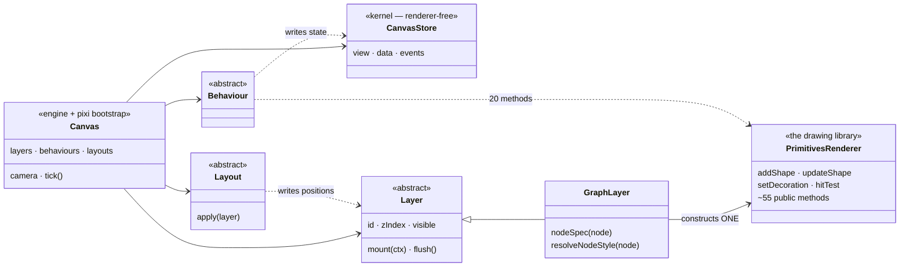
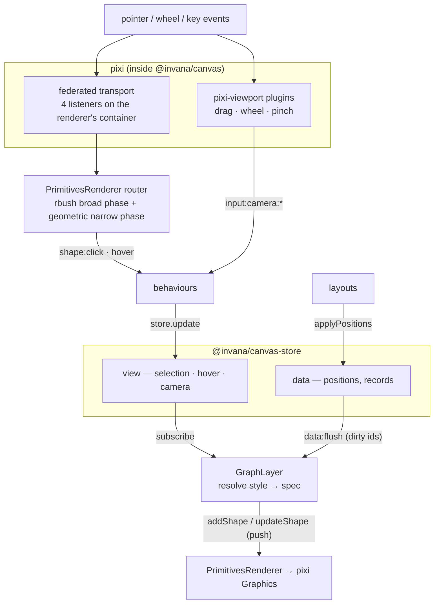

# Current architecture — concepts, data flow, and where pixi is bound

> **Status: AS-BUILT.** What exists today, verified against the code on 2026-08-06. No
> proposals here — the target design and the refactor live in
> [`renderer-split-design.md`](./renderer-split-design.md).
>
> Read this first. Most of the confusion in this area is vocabulary (§2), and most of the
> work is in §5.

---

## 1. The packages

| Package | Owns | Imports pixi? |
|---|---|---|
| `@invana/canvas-store` | **state + events** — `view` (config, selection, hover, camera) · `data` (records, positions) · `events` (one bus) · telemetry · history | no — renderer-free kernel |
| `@invana/canvas` | **the engine *and* the drawing library** — `Canvas`, `Layer`/`Behaviour`/`Layout`, registries, camera, hit index, **plus all of `primitives/`** | **yes — 53 of 119 files** |
| `@invana/graph` | graph domain — `GraphLayer`, behaviours, minimap | **yes — 3 files** (should be zero) |
| `graph-layout-*` (5) | `data in → positions out` | no |
| `graph-layer-*` (3) | overlay layers | **yes — 4 files** (bubble-sets 1, d3-contour 3) |

The kernel is already renderer-free. The problem is entirely in the middle row: `@invana/canvas`
is described as the orchestrator but *is* the drawing library.

---

## 2. Vocabulary — six things are called "layer"

The single biggest source of confusion, so it goes before the diagrams.

| Term | What it actually is | What it is **not** |
|---|---|---|
| `Layer` (`WorldLayer` / `ScreenLayer`) | an engine participant — lifecycle, dirty batching, hit-test, events | a pixi container |
| **surface** (`ctx.world`, `ctx.stage`) | the two roots a layer attaches to — camera-affected vs screen-fixed | — |
| layer **root container** | the pixi `Container` a layer owns | — |
| `connectorLayer` / `shapeLayer` / `overlayLayer` | plain sub-containers **inside one layer**, named "…Layer" but not `Layer`s | `Layer`s |
| `backdropPlane` (pixi `RenderLayer`) | a paint **stripe** — render-order metadata that holds **no children** | a container |
| `plane` (`PlaneName`) | the spec field naming the stripe — the public form of the above | — |

Two collisions cause most of the damage: **`shapeLayer` is not a `Layer`**, and **a
`RenderLayer` is not a container**. Related: `zIndex` means four unrelated things (layer
order, element order within a stripe, group push-back, CSS on DOM overlays), and
`isRenderGroup` is a GPU batching flag that orders nothing.

---

## 3. Concepts — who owns what

Two facts worth holding onto:

- **Exactly one `PrimitivesRenderer` is constructed in the whole repo** — `GraphLayer.ts:338`.
  Every other layer paints directly with pixi helpers.
- **`GraphLayer` calls the renderer imperatively.** It resolves a node's style into a spec
  and *pushes* it: `renderer.addShape(node.id, this.nodeSpec(node))`.

---

## 4. Data flow today

Numbered, because the direction of the last step is what the refactor changes:

1. **Input arrives** through pixi's federated system — but pixi does **no picking**: every
   shape sets `eventMode = 'none'` and the renderer's container claims everything.
2. **The router resolves the hit** itself — rbush for broad phase, then
   `getHitArea().contains()` for the exact silhouette.
3. **Semantic events** (`shape:click`, hover) reach behaviours on the bus.
4. **Behaviours write state** to the store. Layouts write positions.
5. **Layers subscribe** to view changes and to `data:flush` (coalesced dirty ids).
6. **The layer resolves specs and pushes them** into the renderer. ← *the renderer is a
   callee, not a subscriber.*

Three input paths exist in parallel: the pixi transport above, **raw DOM listeners** in four
behaviours (`canvasEl`, `window`, `document`), and **pixi-viewport plugins** for wheel/pinch.

---

## 5. Where pixi is bound

### 5.1 Inside `@invana/canvas` — 53 files

| Group | Files | Note |
|---|---|---|
| `primitives/` — shapes, connectors, decorations, effects, markers, paint, base | 37 | the drawing library |
| `layers/` World/Screen/Background render bodies | 3 | layer *identity* is orchestration; the body is pixi |
| `engine/Canvas.ts` | 1 | `Application` + `Viewport` bootstrap + rAF loop, mixed with lifecycle |
| `camera/Camera.ts` | 1 | wraps `pixi-viewport` |
| `context/CanvasContext.ts` | 1 | exposes `world` / `stage` as pixi `Container`s **publicly** |
| `textures/`, `fonts/` | 1 + assets | GPU textures, icon fonts |
| pure geometry (routers, pathStyles, anchors, sampling) | ~8 | **zero pixi**, but only the renderer consumes them |

### 5.2 Outside `@invana/canvas` — 7 files that break the rules

Root `CLAUDE.md` rules 4/5/6 forbid this; each is a place where the drawing abstraction has
a hole.

| File | What it does | Rules broken |
|---|---|---|
| `graph/layer/MiniMapLayer.ts` | 3 `Graphics` + a `Container`, repainted per change — **and raw pixi pointer events** (`eventMode`, `hitArea`, `.on('pointerdown')`) | 4, 5, **6** |
| `graph/behaviours/LassoSelectBehaviour.ts` | own `Container` + `Graphics`, polygon per pointermove | 4, 5 |
| `graph/behaviours/BrushSelectBehaviour.ts` | same, rectangle | 4, 5 |
| `graph-layer-bubble-sets/BubbleSetsLayer.ts` | contour paths + `Text` labels | 4, 5 |
| `graph-layer-d3-contour/*` (3) | density bands | 4, 5 |

`@invana/graph` even declares `pixi.js` as a **peer dependency** — the packaging fingerprint
of the leak.

**The whole leak surface is 11 drawing operations:** `rect` `stroke` `fill` `clear` `moveTo`
`lineTo` `poly` `closePath` `roundRect` `quadraticCurveTo` `ellipse`. No filters, masks,
blend modes, textures or shaders.

### 5.3 How the leak was made possible

`WorldLayer` / `ScreenLayer` expose `createGraphics(label?)` and `createContainer(label?)`,
whose TSDoc claims they *"keep pixi internal (no `new Graphics()` in user code)"* — but they
return live pixi types. There are **3 call sites** in 2 packages, so retiring them is small.

### 5.4 Straddlers — files that are half orchestration, half drawing

| File | Orchestration half | pixi half |
|---|---|---|
| `engine/Canvas.ts` | lifecycle, registries, `update`/`get` | `Application`, stage/world, render loop |
| `camera/Camera.ts` | abstract `{x, y, zoom}` + commands | `pixi-viewport` realisation |
| `context/CanvasContext.ts` | store, events, camera commands, peers | `world` / `stage` handles |
| `layers/Layer.ts` + World/Screen | identity, lifecycle, options | the render body |
| 4 camera / LOD behaviours | gesture intent | `camera.viewport.*` |

---

## 6. What this currently prevents

| Consequence | Because |
|---|---|
| No second renderer | Drawing and orchestration are the same package |
| Picking needs a GPU | Exact hit geometry is `bodyGfx.containsPoint` — so it can't be tested headlessly |
| Visual state isn't inspectable | Specs are transient arguments to `addShape`, never stored |
| Four visual features are backend-locked | Minimap, lasso, brush, contours draw with raw pixi (§5.2) |
| `IRenderer` is dead code | Defined in the kernel, implemented by nothing |
| Layer authors get pixi handed to them | `createGraphics()` returns a `Graphics` (§5.3) |

---

## 7. What is already portable

Worth stating, because it is most of the engine and none of it has to change:

- **Layouts** — all five packages, zero pixi, `data in → positions out`.
- **The kernel** — store, events, telemetry, history.
- **The event taxonomy** — `shape:*`, `input:*`, `scene:*`, `data:flush`.
- **Most behaviours** — semantic events in, store writes out.
- **The spec vocabulary** — already describes drawing without doing it, though the type
  declarations currently sit interleaved with pixi implementation.
