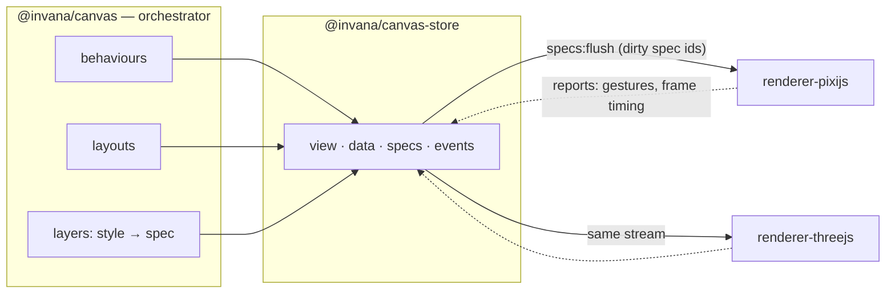
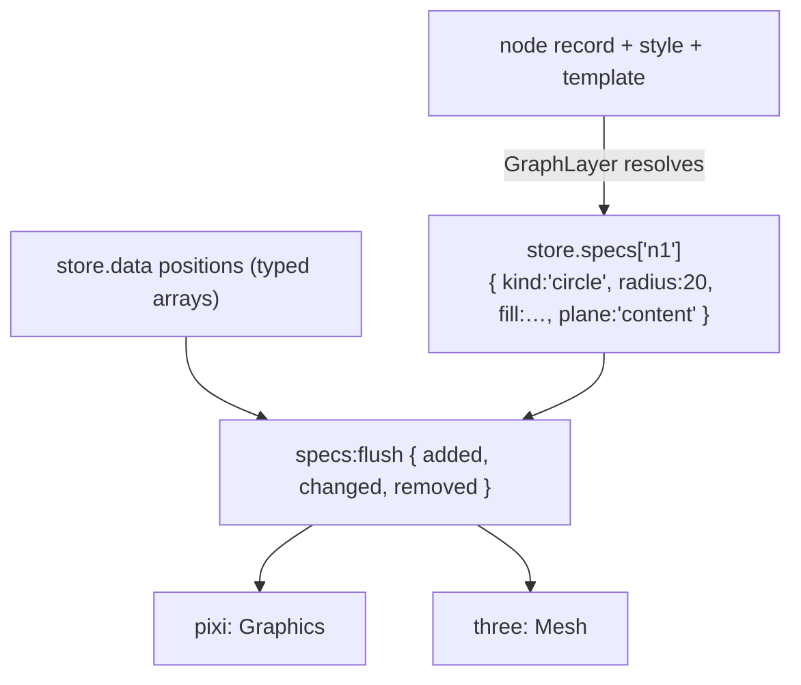

# Renderer split — the target design and how we get there

> **Status: DESIGN.** Where the engine is going: `@invana/canvas` orchestrates, renderers
> draw, and a renderer **subscribes** to state rather than being called.
> Current state is in [`current-architecture.md`](./current-architecture.md).
>
> **This document and [`current-architecture.md`](./current-architecture.md) are the approved
> design of record for this work** — root `CLAUDE.md` rule 15 is satisfied by them, and no
> per-phase RFCs are written. They are updated as phases land.
>
> **Backends in scope: pixi.js now, three.js later.** No three.js work is planned near-term;
> it is designed here (§5) so the canvas and store are built to accommodate it rather than
> retrofitted. React Flow, d3/SVG and canvas-2d were considered and dropped (§7).

---

## 1. The target in one line

> **The store holds the full visual description. Renderers subscribe to it and draw.
> Nothing else changes.**

| Package | Owns |
|---|---|
| `@invana/canvas-store` | state + events + **the resolved specs** (new) |
| `@invana/canvas` | orchestration — `Canvas`, `Layer`/`Behaviour`/`Layout`, registries, camera commands, input pipeline, hit index, **spec vocabulary**. Zero pixi |
| `@invana/renderer-pixijs` | subscribes, draws with pixi — **optional peer** of `canvas`, lazily imported as the default backend (§4.6) |
| `@invana/renderer-threejs` *(later)* | subscribes, draws with three |
| `@invana/graph` | unchanged — resolves node/edge styles into specs |



---

## 2. The one structural change: specs become state

Today a layer resolves a node's style into a spec and **pushes** it:
`renderer.addShape(id, spec)`. The spec exists only as a function argument.

**Target:** the layer publishes the resolved spec into the store; renderers read it.



**Why this and not a push API**

| Gain | Consequence |
|---|---|
| Two backends see **identical input** | Divergence is a renderer bug, not a layer bug |
| Visual state is **serialisable** | Save/restore a rendering, diff two, replay a session |
| Testable **headlessly** | Assert on specs — no GPU, no DOM |
| The renderer interface **collapses** | ~55 imperative methods → subscribe + a small lifecycle surface |
| Durable custom paint (contours, hulls) becomes a `path` spec | One vocabulary for everything that persists — §3 |

**Costs, stated plainly**

| Cost | Mitigation |
|---|---|
| A second copy of visual state in memory | Specs are small plain objects; positions stay in typed arrays and are *not* duplicated |
| A diff step per flush | The dirty-set flush already exists — the renderer reads only `added` / `changed` / `removed` |
| High-churn visuals (lasso drag) would write to the store per pointer move | ✅ **Decided (D3): they don't** — transient visuals use the overlay device and never enter state (§3) |

**Positions do not go into specs.** They stay in typed arrays on the fast path; a spec
carries appearance, the store carries position. A drag frame touches positions only.

---

## 3. Two kinds of visual: durable specs vs transient overlays

**Decided (D3): pointer-rate visuals stay out of the store.** Writing a lasso polygon into
state on every pointer move would put gesture noise into history, undo and saved files, and
force every writer to remember an exclusion flag. So the split is by *lifetime*, not by
feature:

| | **Durable** — a spec in the store | **Transient** — a renderer overlay |
|---|---|---|
| Rate of change | data rate | pointer / camera rate |
| Examples | nodes, edges, group frames, density contours, bubble-set hulls, minimap contents | lasso polygon, brush rectangle, drag ghost, minimap viewport rectangle |
| Serialised / undoable | yes | **never** |
| Survives reload | yes | no |
| How it is drawn | renderer subscribes to `specs:flush` and projects | behaviour calls a small overlay device |

So the **`path` spec kind is still needed** — contours and bubble-set hulls are data-derived
and durable. What it does *not* have to carry is the lasso.

```ts
// durable — a contour hull, recomputed when data changes
store.specs.get('bubbles').set('hull-a', { kind: 'path', points, fill, plane: 'backdrop' });

// transient — the lasso, redrawn on every pointer move, invisible to history and export
const ov = ctx.renderer.overlay('lasso-select', 'world');
ov.clear().poly(this.polygon, true)
  .fill({ color: 0x3b82f6, alpha: 0.08 })
  .stroke({ color: 0x3b82f6, width: 1.5 });
```

**The cost of this choice, stated honestly:** there are two drawing paths instead of one, so
every backend implements the overlay device as well as spec projection, and overlay visuals
are absent from SVG export and from headless snapshots. The upside is that state stays
clean — no gesture noise in undo, no filter logic in history, export or a future collab
layer. The device is deliberately tiny: the **11 operations** those features actually use
(§4.2), nothing more.

---

## 4. The renderer contract

### 4.1 The governing rule

> **Durable state → the store, read by subscription. Per-frame facts → a direct call.**

Camera transform, the visible set and the LOD level change every frame and are derived from
the camera, not authored by a user. Putting them in the store would mean history entries and
diff work sixty times a second. They are commands.

| Kind | Examples | Path |
|---|---|---|
| Durable state | specs, positions, selection, hover, theme | `store` → `specs:flush` / `data:flush` → renderer projects |
| Per-frame command | camera transform, visible set, LOD level | direct call on `IRenderer` |
| Transient visual | lasso, brush, drag ghost | overlay device (§3) |

### 4.2 The interface

```ts
interface IRenderer {
  readonly capabilities: RendererCapabilities;

  // lifecycle
  mount(opts: { container: HTMLElement; store: CanvasStore }): void;
  createSurface(space: 'world' | 'screen', id: string): ISurface;
  destroy(): void;

  // per-frame commands (§4.1)
  applyCamera(t: { x: number; y: number; zoom: number }): void;
  setVisibleSet(layerId: string, ids: ReadonlySet<string> | null): void;   // G4 — null = show all
  setLODLevel(level: number): void;                                        // G5

  // clock — the engine owns the only rAF (G3)
  tick(dtMs: number): void;

  // assets (G2)
  preload(refs: readonly AssetRef[]): Promise<void>;

  // capability-gated
  extract?(opts?: { region?: Rect; scale?: number }): Promise<Blob>;       // G1
  measureText?(text: string, style: TextStyle): TextMetrics;
}

interface ISurface {
  overlay(id: string): IOverlayDevice;      // transient visuals only (§3)
  setVisible(v: boolean): void;
  setZIndex(z: number): void;
  destroy(): void;
}

/** The 11 operations the transient overlays actually use. Not for layer content. */
interface IOverlayDevice {
  clear(): this;
  moveTo(x: number, y: number): this;
  lineTo(x: number, y: number): this;
  quadraticCurveTo(cx: number, cy: number, x: number, y: number): this;
  closePath(): this;
  rect(x: number, y: number, w: number, h: number): this;
  roundRect(x: number, y: number, w: number, h: number, r: number): this;
  ellipse(cx: number, cy: number, rx: number, ry: number): this;
  poly(points: readonly number[], close?: boolean): this;
  fill(style: FillStyle): this;
  stroke(style: StrokeStyle): this;
  destroy(): void;
}

interface RendererCapabilities {
  readonly effects: 'none' | 'style' | 'shader';
  readonly textMode: 'native' | 'sdf' | 'dom';
  readonly rasterExport: boolean;
  readonly depth: boolean;
  readonly specKinds: readonly string[];    // what it can draw; unknown kinds degrade
}
```

### 4.2b The spec change signal (D8)

Today's `data:flush` carries `{ nodes, edges, groups, annotations }` — **graph vocabulary**.
A renderer subscribing to it would have to re-derive which specs changed from a domain
delta, putting graph concepts back inside the backend.

So `store.specs[layerId]` emits its **own** channel, generic and domain-free:

```ts
'specs:flush': { layerId: string; added: string[]; changed: string[]; removed: string[] }
```

Coalesced per frame by the same machinery as `data:flush`. The renderer subscribes to
`specs:flush` for appearance and reads positions from the typed arrays — and never learns
what a node or an edge is.

**The cost:** two flush channels that must stay in step. A spec published without its
position, or a position without its spec, is a half-drawn element — so a layer must publish
both before the frame ends. Ordering rule: **positions first, then specs** (a spec arriving
for an unknown id is skipped; a position for an unknown spec is harmless).

### 4.3 Assets (G2)

Specs carry **references**, never loaded objects: `{ kind: 'image', src }`,
`{ kind: 'glyph', font, codepoint }`. The renderer owns resolution, caching, eviction and
device-pixel-ratio; the engine passes only the intended display size. Because loading is
async, the renderer emits `assets:ready { refs }` on the bus and layers that care repaint —
no spec churn, and headless simply resolves nothing.

### 4.4 One clock (G3)

`Canvas` owns the only `requestAnimationFrame`. Each frame it advances camera easing and
layout simulation, then calls `renderer.tick(dt)` so the backend advances its own decoration
and effect animations and presents. **A renderer must not schedule its own rAF** — pixi's
`Application` ticker stays disabled, as `pixi-viewport`'s already is. One clock means a
deterministic frame order and a test that can drive time by hand.

### 4.5 Export (G1)

Two paths, deliberately different:

| Export | Owner | Works on |
|---|---|---|
| **SVG / vector** | **engine** — serialises specs, no backend involvement | every backend, including headless |
| **Raster (PNG)** | **renderer** — `extract()`, capability-gated | pixi (`extract`), three (`toDataURL`) |

Transient overlays (§3) appear in neither: they are gesture feedback, not content.

The renderer subscribes on `mount` and draws from state:

```ts
store.events.on('data:flush', ({ layerId, delta }) => {
  for (const id of delta.added)   this.create(store.specs.get(id));
  for (const id of delta.changed) this.update(id, store.specs.get(id));
  for (const id of delta.removed) this.remove(id);
  this.applyPositions(store.data[layerId].positions);   // typed arrays, no copy
});
```

**What stays engine-side, for every backend:** the camera transform, picking (rbush +
geometric containment derived from specs), plane ordering semantics, layouts, behaviours,
SVG export. **What a backend owns:** how a spec becomes pixels, text rasterisation, effects,
raster export.

### Unknown spec kinds degrade

A backend declares `specKinds`. An unknown kind is skipped with a `capability:unsupported`
event — never a throw. That is what lets three.js ship with a subset.

---

### 4.6 Default renderer resolution (D1)

`renderer` is optional. When omitted, `Canvas.init` lazily resolves the pixi backend:

```ts
const renderer = opts.renderer ?? (await import('@invana/renderer-pixijs')).createDefault();
```

Three properties this buys, which a hard dependency would not:

- `@invana/canvas` lists `@invana/renderer-pixijs` as an **optional peer**, so it is never
  bundled and a three.js-only consumer need not install pixi at all.
- The import is **inside the async `init` path** — `Canvas.init` is already async, so this
  costs nothing structurally.
- If the package is genuinely absent, the failure is a clear message naming the missing
  dependency, not a module-resolution error.

The honest trade: `canvas`'s package manifest still *mentions* a backend, so the separation
is a convention plus a lint rule rather than a hard graph guarantee. That is the price of
zero migration, and it was chosen deliberately.

**`preference` (D7)** rides along in the same spirit: `Canvas.init({ preference: 'webgpu' })`
is forwarded to whichever renderer is mounted, documented as a hint. pixi honours it; three
ignores it.

---

## 5. three.js as the second backend

Designed, not scheduled. The point is that nothing below requires changing the canvas or the
store — if any row did, that would be a design bug to fix now.

| Concern | pixi | three.js |
|---|---|---|
| Root | `Application` + `Viewport` | `WebGLRenderer` + `Scene` + **orthographic** camera |
| Surface | `Container` | `Group` |
| `circle` / `rect` / `polygon` | `Graphics` geometry | `ShapeGeometry` + `MeshBasicMaterial` |
| `path` (custom paint) | path ops | `BufferGeometry` line / shape |
| Connector | `Graphics` stroke | `Line2` / tube geometry |
| **Planes** | `RenderLayer` stripes | `renderOrder` + small z-offset |
| **Camera** | apply to `Viewport` | apply to the ortho camera — engine still owns the transform |
| **Picking** | engine rbush + geometry | **same** — world-space geometry is known; raycasting optional |
| Text | `Text` / `HTMLText` | SDF glyphs (troika-style) — the main fidelity gap |
| Decorations | 17 kinds | subset first; unknown kinds degrade |
| Effects | filters / shaders | materials / shaders |
| Raster export | `extract` | `domElement.toDataURL` |
| Package | `@invana/renderer-pixijs` — dep `pixi.js`, peers `canvas` + `canvas-store` | `@invana/renderer-threejs` — dep `three`, same peers |

**Two constraints this puts on the engine, today:**

1. **No pixi types in the contract.** `PlaneName` is spec vocabulary; pixi's `RenderLayer`
   is not. Planes are *ordered named stripes* — the mechanism is the backend's business.
2. **Geometry answers must not require the backend.** Picking and bounds derive from specs,
   so both backends agree and headless works.

**Depth is out of scope.** three.js runs orthographic and 2D-equivalent. Real 3D means
`{x, y, z}`, a perspective camera and 3D hit-testing — a **data-model** change across
layouts, hit index, bounds and export. Its own decision, later (**D4**).

**Text is the acknowledged divergence.** SDF metrics and canvas-2d metrics disagree; label
collision tolerates a few percent, label layout is recomputed per backend. `measureText` is
backend-provided.

---

## 6. Refactor path

Each phase is independently landable and revertible. **P1–P3 are valuable on their own**,
whether or not the extraction ever happens.

| Phase | Work | Gate |
|---|---|---|
| **P0** | Split spec **types** out of `primitives/` into a pixi-free `canvas/src/specs/` (incl. `PlaneName`); pure spec maths (`boundsOfSpec`, `scaleShapeSpec`, …) becomes pure functions | `graph` compiles against `specs/` only |
| **P1** | **Specs become state** — `store.specs` + layers publish instead of push; the renderer still reads them via today's imperative calls | Byte-identical rendering; memory measured on a 50k graph |
| **P2** | **Invert the call direction** — the renderer subscribes to `data:flush` and draws; the imperative surface shrinks to §4 | No visual change; `GraphLayer` no longer calls `addShape` |
| **P3** | **Close the 7 leaks** — minimap, lasso, brush, bubble-sets, contours become specs; retire `createGraphics` / `createContainer`; minimap input moves to engine events (rule 6) | `grep -rl "from 'pixi.js'" packages/*/src` → only `packages/canvas` |
| **P4** | **Engine-side geometry** — `contains()` per spec kind (picking without a GPU) + the measurement seam (bounds, text metrics) | Headless picking test passes |
| **P5** | **Gesture arbiter + camera input** — replace the 16 `camera.viewport.plugins.pause()` calls; drop the public `viewport` handle | `camera.viewport` gone from the public surface |
| **P6** | **Extract `@invana/renderer-pixijs`** — move `primitives/`, textures, fonts, the `Application` bootstrap, the viewport binding | `canvas` imports zero pixi (lint-enforced) |
| **P7** | *(later)* `@invana/renderer-threejs` | Same stories render on both |

**Every phase:** `pnpm check-types` + `pnpm build` green, no per-frame cost added, `graph`'s
domain logic untouched.

---

## 7. Considered and dropped

| Backend | Why |
|---|---|
| **React Flow** | **Sovereign** — it owns viewport, picking and gestures, so the engine would cede three subsystems and mirror state back. A different architecture, not a different renderer. (`MapLayer` already runs MapLibre sovereignly *scoped to one layer* — which is where that pattern belongs) |
| **d3 / SVG** | Best conformance test of the options, but caps out near 5–10k DOM nodes and vector output is already covered by the spec-driven `export/svgExport.ts` |
| **canvas-2d** | No use case pixi doesn't serve better |

A **headless** backend is kept — not a product renderer, a test double that makes picking,
layouts, bounds and projection testable with no GPU.

---

## 8. Decisions — all settled

| ID | Question | Recommendation |
|---|---|---|
| **D1** | Is `renderer` required on `Canvas.init`, or defaulted to pixi? | ✅ **Decided: default to pixi.** Zero migration — existing calls, ~200 stories and every test keep working; `renderer:` is opt-out. **Consequence:** `canvas` must be able to reach `renderer-pixijs`. **Mitigation (see §4.6):** resolve the default by *lazy `import()`* against an **optional peer dependency**, so `canvas` never bundles pixi and a three.js-only consumer need not install it |
| **D2** | Do specs live in one collection or per layer? | ✅ **Decided: per layer** — `store.specs[layerId]`, matching `data:flush`'s `layerId`; layer teardown is one delete |
| **D3** | How do high-churn visuals (lasso at pointer rate) avoid polluting history? | ✅ **Decided: keep them out of the store** — a small renderer overlay device (§3, §4.2). Accepts two drawing paths in exchange for state that never carries gesture noise |
| **D4** | Does three.js get real depth (`z`, perspective)? | ✅ **Closed: not now.** Orthographic 2D parity first. Real 3D changes `{x, y}` positions, the camera, hit-testing, bounds and export — a data-model RFC, reopened only if wanted |
| **D5** | Where does the hit index live after the split? | ✅ **Closed: `canvas`.** Settled by the rest of the design — engine-side picking, `contains()` derived from specs, headless picking tests. Anywhere else contradicts P4 |
| **D6** | Do the four LOD setters (`setShapeTextVisible`, …) survive as methods? | ✅ **Resolved by G5** — replaced by a single `setLODLevel(level)` per-frame command; the renderer decides what a level shows. Zero spec churn on zoom |
| **D8** | How do renderers learn which specs changed? | ✅ **Decided: a dedicated `specs:flush` channel** (§4.2b) — generic `{ added, changed, removed }`, no domain words. Costs a second channel to keep in step with `data:flush` |
| **D9** | What enforces "no visual change" across 328 stories? | ✅ **Decided: manual sweeps.** No screenshot tooling is added. **Accepted risk, recorded here:** P2 and P6 have no automated appearance net — the headless tests (G6) cover picking, spec projection, layouts and bounds, but *not* how it looks. Mitigation is sequencing: land P0–P3 in small, individually revertible steps so a visual regression is bisectable |
| **D10** | Rule 15 requires an RFC before code | ✅ **Decided: these two design docs are the record.** No per-phase RFCs; the §9 checklist is the plan of record and is updated as phases land |
| **D11** | Is "spec" the right word for the pixi-free description of a thing to draw? | ✅ **Decided: keep `spec`.** 652 occurrences across 56 files, some exported from `pkg:@invana/graph` — and it collides with nothing here, unlike `scene` (8 `scene:*` bus events), `element` (already means node-or-edge) and `primitive` (the renderer folder). `visual` and `descriptor` read better as state but not by enough to justify the churn. Applies uniformly: folder `canvas/src/specs/`, subpath `@invana/canvas/specs`, `store.specs[layerId]`, `specs:flush`, `*Spec` types |
| **D7** | Does `preference: 'webgpu' \| 'webgl'` stay on `Canvas`? | ✅ **Decided: stays on `Canvas`, forwarded to the renderer.** Non-breaking. **Consequence:** the generic API carries a pixi-shaped option; it is documented as a *hint* that backends may ignore, and three.js ignores it |

---

## 9. Migration checklist

Ordered. `⚠` = the risky ones. A phase is done when its **gate** passes.

### P0 — spec vocabulary (no behaviour change) ✅ **landed 2026-08-06**
- [x] Create `canvas/src/specs/`: `shape.ts` · `connector.ts` · `decoration.ts` · `plane.ts` · `style.ts`
- [x] Move spec **types** out of `primitives/types.ts`, leaving `IShape` / `IConnector` (they carry `gfx`) renderer-side
- [x] Move pure spec maths to `specs/geometry.ts` — **only `connectorGeometryKey` qualified.** The other four (`boundsOfSpec` · `scaleShapeSpec` · `collapsedShapeSpec` · `fitShapeSpecToContent`) are three-line registry lookups; the maths lives in `static` methods on the shape classes, so it migrates in P4 instead
- [x] Add the **`path` spec kind** (points + stroke + fill) — P3 depends on it
- [x] Repoint `@invana/graph` imports to `@invana/canvas/specs`
- [x] **Gate:** `graph` compiles referencing `specs/` only (7 modules import the subpath; zero import a drawing library)

### P1 — specs become state ✅ **landed 2026-08-06**
- [x] Implement `store.specs[layerId]` — per-layer collections (D2 ✅). `SpecStore<T>` is generic: the kernel has no `@invana` deps, so the spec *vocabulary* stays in `canvas` and the kernel just holds the collection
- [x] Implement the **`specs:flush`** channel — generic `{ added, changed, removed, version }`, frame-coalesced, muted in telemetry logging like `data:flush` (D8 ✅, §4.2b)
- [x] ⚠ Capture **baselines first**: heap + frame timing at 50k nodes, before any change

  **Measured 2026-08-06** (node, `--expose-gc`, 50k circle shapes with fill + stroke):

  | | Today's push path | `store.specs` adds | Delta |
  |---|---|---|---|
  | Heap | 277.65 MB (**5 823 B/shape**) | 8.72 MB (**183 B/spec**) | **+3.1 %** |
  | Build time | 160.4 ms `addShape` | 12.4 ms `Map.set` | +7.7 % |
  | Per-flush read (500 ids) | — | 0.056 ms | negligible |

  The fear behind this gate — "a second copy of visual state" — does not
  materialise: a spec is ~183 B against a rendered shape's ~5.8 KB, because the
  expensive part is the pixi display object, not the description. Positions stay
  in typed arrays and are not duplicated. **Gate threshold set at ≤ 10 % heap.**
- [x] Confirm transient visuals are **not** modelled as specs — lasso, brush and the minimap draw through `IOverlayDevice`; nothing transient reaches the store
- [x] `GraphLayer` publishes resolved specs — at the five sites where a spec is resolved **for rendering**, never at the measurement sites (`boundsOfSpec` callers resolve throwaway specs). Removals unpublish; teardown clears.
  ⚠ **Dual-write, deliberately**: the renderer is still pushed to as well. Turning the push off is P2's job, not a half-step here
- [→] Renderer reads specs from the store — **moved to P2.** Making it read while still being called imperatively adds a third code path with no benefit; P2 inverts read *and* write together
- [x] Confirm positions stay in typed arrays and are **not** duplicated into specs
- [ ] ⚠ **Measure**: heap + flush cost on a 50k-node graph, before vs after
- [ ] **Gate:** rendering byte-identical; memory delta acceptable

### P2 — invert the call direction ✅ **landed 2026-08-06**
- [x] Renderer subscribes on mount — to **`specs:flush`**, projecting `added` / `changed` / `removed`
- [x] Implement `added` / `changed` / `removed` projection from the delta. Shape vs connector is resolved by **which registry owns the `kind`** (`renderer.shapeKinds`), so no discriminator is baked into the vocabulary
- [x] Remove every `addShape` / `updateShape` / `addConnector` / `updateConnector` push from `GraphLayer` — the five sites now publish, and `projectSpec` reads back from the store. **Decorations, labels and badges are not specs yet**, so those calls remain (they follow in a later phase)
- [→] Shrink the imperative surface to the §4 contract — **partly**: element add/update/remove is off the imperative path; decorations/labels/badges/LOD are not
- [x] ⚠ Verify ordering — the layer's own publishes project **synchronously**, so the label / decoration / badge syncs that follow still find the element mounted. The coalesced flush then covers *external* writes only, skipping ids already projected this frame
- [x] **Gate:** `GraphLayer` makes no draw calls — it publishes specs and drives `IElementRenderer`, and names no backend type (P6.1)

### P3 — close the 7 pixi leaks ✅ **landed 2026-08-06**
- [x] `graph-layer-d3-contour` ×3 → `path` specs *(smallest — do first as the proof)*
- [x] `BubbleSetsLayer` → `path` specs + text spec
- [x] `LassoSelectBehaviour` → **overlay device** (transient, §3)
- [x] `BrushSelectBehaviour` → **overlay device**
- [x] `MiniMapLayer` **drawing** → **three screen-space overlay devices** (backdrop / mirrored graph / viewport box). It repaints on every camera move, so per §3's own table the whole thing is camera-rate and transient — not published state
- [x] ⚠ `MiniMapLayer` **input** → DOM listeners on `ctx.canvasElement` + a rectangle test, replacing raw `eventMode` / `hitArea` / `.on('pointer*')` (rule 6). No hittable-region concept was needed after all: the minimap owns a known screen rect, so a hit is a coordinate comparison
- [x] Retire `createGraphics()` / `createContainer()` — gone with the layer bases' `container` getter in P6.3; a layer publishes specs or draws through `surface.overlay(...)`
- [x] Remove the `pixi.js` **peer dependency** from `@invana/graph`
- [x] Add the lint rule — **superseded and strengthened.** The boundary is now "only a *backend*
  package", not "only `packages/canvas`", and it is enforced by `pnpm check-boundaries`
  (hard, exits non-zero) plus an ESLint rule (editor feedback only — `eslint-plugin-only-warn`
  downgrades every rule to a warning)
- [x] **Gate:** `grep -rl "from 'pixi" packages/*/src apps/storybook/stories` → only
  `packages/renderer-pixijs`

### P4 — engine-side geometry + measurement 🚧 *picking done; measurement + bounds outstanding*
- [x] **Migrate the per-kind spec maths off the shape classes** into `specs/shapeGeometry/` as pure functions — `boundsOf` · `scaleSpec` · `collapsedOf` · `fitToContent`, joined by the new `contains`. Found in P0: these `static`s are the real spec maths, and under P6 they would otherwise leave with the renderer, taking bounds and picking with them.
  The shape classes now delegate; `_polyUtils` and the whole tabbed-rect silhouette moved with them, and the composite's **spec types** moved to `specs/shape.ts` (they were the last spec vocabulary still living in a shape file)
- [x] `contains(spec, x, y, tolerance)` per spec kind — circle · rect · ellipse · polygon · path · star · arc · regular-polygon · tabbed-rect · composite
- [x] ⚠ Replace `bodyGfx.containsPoint` in the hit-test narrow phase — must match stroke tolerance closely enough that no click feels different.
  Two pixi behaviours are reproduced deliberately: a shape with **no silhouette fill is hollow** (only its stroke band picks), and the stroke widens by pixi's `outer = (1 - alignment) * width` split. `getHitArea()` remains the fallback for `registerShape` kinds the spec geometry doesn't know
- [x] ⚠ **Lift the whole picking engine out of the renderer** — `hit/PickingIndex.ts`. The
  index was *inside* `PrimitivesRenderer` (rbush, hit boxes, `hitTest`, `pickHover`, the
  two-band ranking, culling), so under P6 it would have left with pixi, contradicting D5.
  It now lives engine-side and the renderer is only its **`HitGeometrySource`**.
  **Pull, not push, and this is the load-bearing decision:** three facts are the renderer's
  to know — the visual `scale` a LOD behaviour writes without touching the spec, a
  connector's routed polyline (the router runs at draw time), and a `registerShape` custom
  kind's silhouette. Reading them at query time keeps picking answering against what is on
  screen; pushing them would add a second staleness surface beside the deferred-bbox one,
  and a stale pick is felt immediately
- [x] Hit **bounds** are spec-derived — `boundsOfSpec(spec)` × the record's scale, with the
  instance's `bounds()` kept only as the custom-kind fallback. `shapeWorldBounds` and the
  hit boxes are now one implementation, so they cannot drift
- [x] `cull()` → **`setVisibleSet(ids | null)`** (G4) — the engine computes the visible set
  from its index, the renderer only applies it. `cull` / `uncull` remain as conveniences
  over it; neither had any caller outside the renderer
- [x] Layer bounds seam — exists as `WorldLayer.getBounds()`, with `GraphLayer` overriding it. The row named a method that had been built under a different name
- [x] `measureText` seam — landed as `IElementRenderer.measureLabel`, backend-provided (SDF and canvas-2d metrics genuinely disagree)
- [x] `fitContent` null-guard — **centralised instead**: `Camera.fitContent` takes `Rect | null | undefined` and returns early, so no call site needs a guard
- [x] Headless picking test — **mandate granted (G6)**: `tests/specs/contains.test.ts` covers
  all ten kinds (inside / outside / stroke edge / concave notch), and
  `tests/hit/PickingIndex.test.ts` (19 tests) now covers the *engine*: ranking, hit floor vs
  zoom, the scale divisor, deferred-bbox flush, both hover heuristics and connector hit-box
  splitting — with no renderer mounted, no GPU, no DOM. Spec projection and layout output
  are still uncovered
- [x] **Gate:** picking resolves with no GPU

**One deliberate behaviour change, recorded because it is not a pure move.** A connector's
single-box index entry was the AABB of its raw `Path` **including bezier control points**
(`pathBounds`); it is now the AABB of the **sampled polyline** — the same polyline the narrow
phase measures distance against. The box is therefore tighter for curved edges. Picks are
unchanged: any point the narrow phase would have accepted still falls inside the box (the
padding is exactly the hit tolerance, and the floor band rides on the *query* padding, not the
entry), so only candidates the narrow phase was going to reject anyway are pruned. Culling
becomes marginally less conservative in the same way.

### P4.5 — the renderer contract becomes real 🚧 **landed 2026-08-08 (classification pending in part)**

Not a phase in the original plan; it turned out to sit between P4 and P6, because P6 cannot
move a contract that doesn't exist.

- [x] ⚠ **The kernel's `IRenderer` was a fiction — retired.** It declared
  `applyView` / `applyData`: an orchestrator-pushes-deltas model that **P2 replaced** with spec
  state + `specs:flush` + `SpecProjector`. It had zero implementers *and* zero callers, which is
  precisely how a stale interface survives unnoticed. The real contract also turns out to be
  *made of spec vocabulary* (surfaces project `BaseShapeSpec`; overlays draw engine geometry),
  and the kernel imports no `@invana` package — so it could never have lived there without
  inverting the layering. `@invana/canvas-store` keeps only `RendererBackend` +
  `RendererInitOptions`, the genuinely device-shaped half
- [x] **`IRenderer` now lives in `canvas/src/renderer/IRenderer.ts`** and describes what actually
  happens: `mount` → `createSurface` / `createOverlay` / `createCameraBinding` → `tick`, plus
  `backend`, `capabilities`, `resize`, optional `extract`. Input is **not** a member (a renderer
  publishes `input:*` on the shared bus); nor is picking (D5)
- [x] **`PixiRenderer` — the first implementer.** Owns the `Application`, the WebGPU→WebGL
  fallback, the shared texture-pool ref-count, the render-crash guard, the drawing surface and
  its resize plumbing, the scene root, and the surface / overlay / camera-binding factories.
  `Canvas.init` went from ~90 lines of pixi bring-up to `new PixiRenderer(...)` + `mount(...)`;
  `Canvas` holds no `Application`, `Viewport` or `Container` of its own
- [x] ⚠ **`Camera` is pixi-free** — the pixi-viewport realisation moved behind
  **`ICameraBinding`** (`PixiViewportBinding`). This is P6's "split camera/Camera.ts" row, landed
  early because P5 had already funnelled every viewport touch through `Camera`, which made the
  extraction mechanical. `Camera` keeps the semantics (clamp, anchored zoom, fit, bus, store
  sync); the binding keeps the plugin registry and the key-code mapping.
  New: `tests/camera/CameraHeadless.test.ts` drives the whole camera through a fake binding —
  no pixi, no GPU, no DOM
- [x] ⚠ **G3 — the clock is inverted back. Landed 2026-08-10.** `Canvas` owns the only
  `requestAnimationFrame`: each frame it advances engine state (`tickOnce` — camera easing, data
  flush, culling, layers) and *then* calls `renderer.tick(dt)`, now the sole thing that presents.
  Pixi's `Application` is created with `autoStart: false` and its ticker stopped, so there is
  exactly one clock. `IRenderer.startLoop` — the transitional seam — is **gone from the contract**.
  Order is the point: a backend scheduling its own frames presents state from the *previous* tick.
  Verified in Storybook — 120fps / 8.1ms frame (unchanged), and the marching-ants dash phase
  advances, so `tickAnimations` still runs. In node there is no rAF, so the loop is inert and a test
  drives `tickOnce` by hand — exactly what one clock buys, now pinned by a test
- [ ] `attachCamera` ordering — surfaces need a `Camera` (hit-floor scaling, label-raster
  priority), so the sequence is `createCameraBinding` → `new Camera` → `attachCamera` →
  `createSurface`. Works, but it is a construction-order constraint encoded in a throw rather
  than in types

**Where the imperative surface lands.** ~30 methods `@invana/graph` calls on `layer.renderer`,
classified. **(a)** spec state · **(b)** per-frame command · **(c)** engine-side geometry answer ·
**(d)** stays on the renderer contract.

| Methods | Verdict | Status |
|---|---|---|
| `addShape` · `updateShape` · `removeShape` · `addConnector` · `updateConnector` · `removeConnector` · `hasShape` · `hasConnector` | **(d)** — this *is* `SpecProjectionTarget`, driven from `specs:flush`. Graph's direct calls are the pre-P2 path | ✅ contract exists; graph's remaining direct calls are P6 cleanup |
| `hitTest` | **(c)** — `PickingIndex`; the renderer forwards | ✅ landed (P4) |
| `getShapeWorldBounds` · `getShapePosition` · `getConnectorPolyline` · `connectorGeometryUnchanged` | **(c)** — spec + routed-path geometry | 🚧 `getShapeWorldBounds` now reads through the index; the rest still read instances |
| `boundsOfSpec` · `scaleShapeSpec` · `fitShapeSpecToContent` | **(c)** — pure spec maths already in `specs/shapeGeometry/`; the renderer only adds registry lookup for custom kinds | 🚧 needs a registry-backed engine-side helper so the wrapper can go |
| `setShapeTextVisible` · `setShapeIconVisible` · `setShapeImageVisible` · `setLabelsResolution` | **(b)**, but ⚠ **not as G5 describes** — see the note below the table | ❌ G5 revised |
| `cull` / `uncull` | **(b)** — `setVisibleSet(ids \| null)` (G4) | ✅ landed |
| `setDecoration` (15 sites) · `setBadge` · `removeBadge` · `getDecoration` · `setDecorationVisible` | **(a)** — decoration *styles* and badges joined the spec vocabulary in `839d1a2`, but **attachment is still imperative**. This is the single largest remaining block | 📋 the big one; own step |
| `getDecorationWorldBounds` | **(c)** once decorations are specs; **(d)** until then — it reads a live gfx container | 📋 blocked on the row above |
| `measureLabel` | **(d)**, capability-gated — this is the `measureText` seam. Text metrics are irreducibly backend-specific (SDF vs canvas-2d disagree) | 📋 P4 row still open |
| `scaleShape` · `moveShape` · `setConnectorStroke` · `scaleConnectorStroke` | **(b)** — per-frame fast paths that deliberately bypass spec churn. They stay commands; making them spec writes would put drag/zoom noise into state (D3's reasoning, applied to transforms) | ✅ decided, no change needed |
| `reindexScaledShapeHits` · `reanchorAllConnectors` | **(b)** — settle-time flushes. `reindexScaledShapeHits` is already engine-side (`PickingIndex.reindexShapes`); `reanchorAllConnectors` is genuinely renderer work (re-routing) | ✅ decided |

⚠ **G5 is wrong as designed, and was not implemented as written.** It calls for one global
`setLODLevel(level)` where "the renderer decides what a level shows". But the LOD behaviours make
**per-element** decisions: `TextLODBehaviour` hides labels *except* the top-N nodes by degree
(`alwaysShowTop` → an exemption set), and `Icon`/`ImageLODBehaviour` toggle per id. A single global
level cannot express "hide labels except the most central 10%", so collapsing to it would lose
capability, not merely churn. The three setters stay per-element commands. What G5 actually wanted —
no spec churn on zoom — is already true: they are commands, not spec writes. Reopen only if a
backend needs to *interpret* a level rather than be told per element.

### P5 — gesture arbiter + camera input ✅ **landed 2026-08-07**
- [x] `GestureArbiter` — `claim(owner) → release`, `owner`
- [x] `DragPanBehaviour` yields when `gestures.owner` is set
- [x] Migrate the 16 `camera.viewport.plugins.pause/resume` uses → claim/release (5 graph behaviours + `DragShapeBehaviour`)
- [x] ⚠ Release on unmount / gesture abort — a leaked claim freezes the camera
- [x] `camera.configureInput({ wheel, pinch })`; migrate `WheelZoomBehaviour` + `PinchZoomBehaviour`
- [x] Remove the public `camera.viewport` handle — the `Viewport` is now **private** to `Camera`.
  Three seams replaced the reach-throughs: `configureInput({ drag })` (pan + momentum, the
  last plugin still installed from outside), `setDragSuspended(bool)` for gesture yielding,
  and `onDragStart(fn)` for the `space`-modifier cursor fallback.
  ⚠ **`setTransform({x,y,zoom}, { clamp })` is the one genuinely new capability**: a layer
  mirroring an *external* camera authority needs to write the transform verbatim (no centre
  re-anchoring) and outside the canvas's zoom clamp — `MapLayer` was writing
  `viewport.scale/position` raw for exactly that reason, and web mercator's `2 ** 22` sits far
  past the default ceiling of 100. It emits `input:camera:zoom` only when the scale changed,
  which is the pan-only optimisation `MapLayer` used to hand-roll
- [x] **Gate:** no `camera.viewport` outside renderer-side code — **zero live callers repo-wide**
  (three historical mentions survive in comments). `PrimitivesRenderer`'s one use was a cast
  around `getVisibleBounds()`, which `Camera` already exposes typed

### P5.5 — split `primitives/` into drawing vs geometry ✅ **landed 2026-08-09**

Discovered while mapping the extraction: of the 78 files in `primitives/`, **only 39 imported
pixi**. The rest were routers, path styles, anchors, path sampling, badge placement and tweens —
code a three.js backend would reuse verbatim. Moving them into the pixi package would have
contradicted §5 ("geometry answers must not require the backend"), the same rule that already put
picking (D5) and bounds (P4) engine-side. So the folder was split *before* the move, and
`primitives/` is now exactly the set that leaves.

| Moved engine-side | Files | Why |
|---|---|---|
| `src/connectors/` — `routers/` · `pathStyles/` · `anchors/` · `pathSampling.ts` | 25 | spec in, `Path` out; no display object |
| `src/badges/` | 3 | placement maths over a host `Rect` / `Path` |
| `src/animation/` | 2 | `Tween` produces numbers, not pixels |
| barrels for the three | 3 | so the root re-exports them, not `primitives/index.ts` |

- [x] All 30 moved files depend only on `specs/` — every shared type (`IRouter`, `IPathStyle`,
  `IAnchor`, `Path`, `Point`, `Vec2`, `Obstacle`, `Endpoint`) was already there from P0, so no type
  surgery was needed
- [x] `primitives/index.ts` no longer re-exports any of it; the root barrel does
- [x] ⚠ **Dependency direction verified one-way**: 26 imports run drawing → geometry, **zero** run
  geometry → drawing
- [x] **Gate:** `primitives/` is 48 files, 39 with pixi; the engine-side 33 have **zero**

⚠ **Correction to the first classification.** Effects (4) and the decoration / effect base classes
(4) were initially counted as "pure" because they import no pixi. They stay with the drawing after
all: `ShapeEffectHostInfo` and `ConnectorEffectHostInfo` hold live `IShape` / `IConnector`
references, and the decoration bases extend `PrimitiveBase` and write `this.gfx`. The dividing line
is therefore **"does it reference a live primitive instance"**, not "does it import pixi" — a
sharper test, and the one to apply to anything added later.

### P6 — extract `@invana/renderer-pixijs` ✅ **landed 2026-08-09**
- [x] Scaffold the package — tsup, peers on `canvas` + `canvas-store`, `pixi.js` dep, eslint config
- [x] Move the drawing code — **60 files**: `primitives/` (48 after the P5.5 split), the four
  `Pixi*` classes, `textures/`, `fonts/`, `instancing/`, `sharedTexturePool`, `rendererSupport`
- [x] Split `engine/Canvas.ts` — `Application` + viewport bootstrap out (P4.5); the render loop
  stays inverted behind `startLoop` (G3 open, deliberately)
- [x] Split `camera/Camera.ts` — pixi-viewport binding out behind `ICameraBinding` (P4.5)
- [x] `WorldLayer` / `ScreenLayer` take a surface; the `container` getters are gone (P6.3)
- [x] `CanvasContext` dropped `world` / `stage`; gained `createSurface` / `createOverlay` (P6.2)
- [x] ⚠ **`Canvas.init({ renderer? })` — optional, lazy-import default (D1, §4.6).** The dynamic
  import is typed **structurally**, not against the backend's own types: importing them would put
  `@invana/canvas` back in a build cycle, and the engine must compile with no backend installed.
  That is the difference between an optional peer and a dependency wearing its name
- [x] `preference` stays on `Canvas` and is forwarded as a hint (D7)
- [x] `canvas-react` re-exports the capability probes from the backend — they interrogate *pixi's*
  backends, so a three.js renderer would answer a different question
- [x] Storybook depends on the backend; 93 stories repointed
- [x] Drop the `primitives` subpath from `canvas`; export `specs` — **wholesale**, values and
  types. The per-kind geometry (`boundsOfCircle`, `containsRect`, …) is what a backend needs to
  draw a silhouette, and hand-picking that list breaks the moment a second backend needs one more
- [x] **Gate:** `grep -rl "from 'pixi" packages/*/src apps/storybook/stories` → **only
  `packages/renderer-pixijs`**
- [x] Enforce the boundary — **two mechanisms, deliberately.** `pnpm check-boundaries`
  (`scripts/check-renderer-boundary.mjs`) exits non-zero and runs inside the root `pnpm lint`;
  an ESLint `no-restricted-imports` rule gives editor feedback. The rule alone was not enough:
  the shared config loads `eslint-plugin-only-warn`, which downgrades every rule to a warning,
  so it can surface a violation but never fail a build. Verified by planting a `pixi.js` import
  in `packages/canvas` and watching both fire
- [🚧] Storybook sweep **done 2026-08-10** — background patterns (incl. the new `setBackdrop`),
  Les Misérables + d3-force, drag-pan, wheel zoom, custom shapes (cross-package `ShapeBase`
  subclassing), metro router with obstacle avoidance, minimap, composite cards: all render, no
  console errors, ~15 story navigations clean.
  ⚠ **Hover and click-select could not be verified.** They do not respond to synthetic CDP input —
  but a worktree build of the pre-refactor commit `c828b4e` behaves *identically*, so this is not a
  regression from the split. Picking is **unchanged, not verified**; it wants a human hover/click

**`rbush` stayed with the engine.** It was stripped alongside the pixi dependencies and had to go
back: `PickingIndex` is engine-side (D5), so the spatial index is the *engine's* dependency and the
backend has no use for it. A dependency list is a claim about who owns what, and that one was
briefly wrong.

### P7 — `@invana/renderer-threejs` *(later, not scheduled)*
- [ ] Scaffold; declare `capabilities` incl. `specKinds`
- [ ] Shape kinds subset → `ShapeGeometry`; `path` → `BufferGeometry`
- [ ] Planes → `renderOrder` + z-offset; orthographic camera driven by `applyCamera`
- [ ] SDF text + `measureText`
- [ ] Degrade unknown spec kinds via `capability:unsupported`
- [ ] **Gate:** the same stories render on both backends

### Docs + housekeeping (fold into the phase that touches them)
- [x] Root `CLAUDE.md` — workspace table, dependency layering, and global rules 4–5 rewritten around the boundary
- [x] `packages/canvas/CLAUDE.md` — rewritten: the package no longer owns `primitives/`, so the stale shape list went with it
- [x] `packages/renderer-pixijs/CLAUDE.md` — de-staled (was still "scaffolded" / future tense)
- [x] `packages/canvas-store/src/renderer/IRenderer.ts` — moot: the stale `IRenderer` was retired in P4.5 and the file rewritten
- [ ] Kernel leftovers: supersede `canvas/src/state/Store.ts`; relocate `engine/CanvasConfig.ts` patch helpers

---

## 10. Gaps — now designed

All six had no home when the phases were first written. Five are folded into the contract;
the sixth is a policy call you have made.

| ID | Gap | Resolution | Where |
|---|---|---|---|
| **G1** | Raster export uses pixi's `extract` | Split by owner: **SVG stays engine-side** (spec-driven, works headless); **raster is `IRenderer.extract?()`**, capability-gated | §4.5 |
| **G2** | No seam for images / icon fonts / DPR | Specs carry **asset references**; the renderer owns loading, caching, eviction and DPR, and announces `assets:ready` | §4.3 |
| **G3** | `tickAnimations` is duck-typed off `Canvas.tickOnce` | **One clock**: the engine owns the only rAF and calls `renderer.tick(dt)`. Renderers never schedule their own | §4.4 |
| **G4** | `cull()` puts policy in the renderer | Engine computes the visible set from its index → `setVisibleSet(layerId, ids)` as a per-frame command | §4.1–4.2 |
| **G5** | Four LOD setters duplicate spec patches | One `setLODLevel(level)` command; the renderer maps level → what it draws. The four methods disappear | §4.2 |
| **G6** | Tests forbidden in `packages/canvas` by rule 10 | ✅ **Granted for this migration** — headless coverage for picking geometry, spec projection, layout output and bounds | §9 |

## 11. What does not change

Stated because it is most of the engine, and it is the reason this is tractable:

- **Layouts** — zero changes. `data in → positions out`.
- **`@invana/graph`'s domain logic** — style resolution, templates, `nodeSpec`, the store.
- **The event taxonomy** — same names, same payloads.
- **Behaviours that speak semantic events** — the large majority.
- **The kernel** — store, events, telemetry, history.
