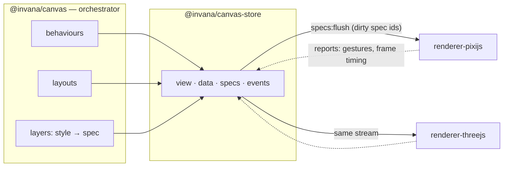
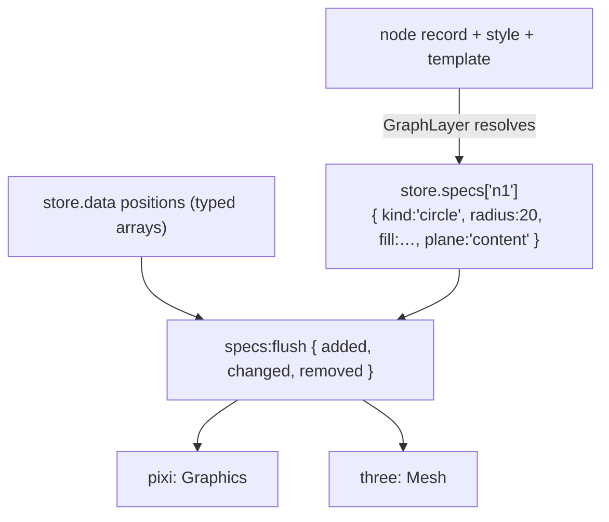

# Renderer split — the target design and how we get there

> **Status: DESIGN.** Where the engine is going: `@invana/canvas` orchestrates, renderers
> draw, and a renderer **subscribes** to state rather than being called.
> Current state is in [`current-architecture.md`](./current-architecture.md).
>
> **This document and [`current-architecture.md`](./current-architecture.md) are the approved
> design of record for this work** — root `CLAUDE.md` rule 15 is satisfied by them, and no
> per-phase RFCs are written. They are updated as phases land.
>
> **Backends in scope: pixi.js now, three.js later.** No three.js work is planned near-term;
> it is designed here (§5) so the canvas and store are built to accommodate it rather than
> retrofitted. React Flow, d3/SVG and canvas-2d were considered and dropped (§7).

---

## 1. The target in one line

> **The store holds the full visual description. Renderers subscribe to it and draw.
> Nothing else changes.**

| Package | Owns |
|---|---|
| `@invana/canvas-store` | state + events + **the resolved specs** (new) |
| `@invana/canvas` | orchestration — `Canvas`, `Layer`/`Behaviour`/`Layout`, registries, camera commands, input pipeline, hit index, **spec vocabulary**. Zero pixi |
| `@invana/renderer-pixijs` | subscribes, draws with pixi — **optional peer** of `canvas`, lazily imported as the default backend (§4.6) |
| `@invana/renderer-threejs` *(later)* | subscribes, draws with three |
| `@invana/graph` | unchanged — resolves node/edge styles into specs |



---

## 2. The one structural change: specs become state

Today a layer resolves a node's style into a spec and **pushes** it:
`renderer.addShape(id, spec)`. The spec exists only as a function argument.

**Target:** the layer publishes the resolved spec into the store; renderers read it.



**Why this and not a push API**

| Gain | Consequence |
|---|---|
| Two backends see **identical input** | Divergence is a renderer bug, not a layer bug |
| Visual state is **serialisable** | Save/restore a rendering, diff two, replay a session |
| Testable **headlessly** | Assert on specs — no GPU, no DOM |
| The renderer interface **collapses** | ~55 imperative methods → subscribe + a small lifecycle surface |
| Durable custom paint (contours, hulls) becomes a `path` spec | One vocabulary for everything that persists — §3 |

**Costs, stated plainly**

| Cost | Mitigation |
|---|---|
| A second copy of visual state in memory | Specs are small plain objects; positions stay in typed arrays and are *not* duplicated |
| A diff step per flush | The dirty-set flush already exists — the renderer reads only `added` / `changed` / `removed` |
| High-churn visuals (lasso drag) would write to the store per pointer move | ✅ **Decided (D3): they don't** — transient visuals use the overlay device and never enter state (§3) |

**Positions do not go into specs.** They stay in typed arrays on the fast path; a spec
carries appearance, the store carries position. A drag frame touches positions only.

---

## 3. Two kinds of visual: durable specs vs transient overlays

**Decided (D3): pointer-rate visuals stay out of the store.** Writing a lasso polygon into
state on every pointer move would put gesture noise into history, undo and saved files, and
force every writer to remember an exclusion flag. So the split is by *lifetime*, not by
feature:

| | **Durable** — a spec in the store | **Transient** — a renderer overlay |
|---|---|---|
| Rate of change | data rate | pointer / camera rate |
| Examples | nodes, edges, group frames, density contours, bubble-set hulls, minimap contents | lasso polygon, brush rectangle, drag ghost, minimap viewport rectangle |
| Serialised / undoable | yes | **never** |
| Survives reload | yes | no |
| How it is drawn | renderer subscribes to `specs:flush` and projects | behaviour calls a small overlay device |

So the **`path` spec kind is still needed** — contours and bubble-set hulls are data-derived
and durable. What it does *not* have to carry is the lasso.

```ts
// durable — a contour hull, recomputed when data changes
store.specs.get('bubbles').set('hull-a', { kind: 'path', points, fill, plane: 'backdrop' });

// transient — the lasso, redrawn on every pointer move, invisible to history and export
const ov = ctx.renderer.overlay('lasso-select', 'world');
ov.clear().poly(this.polygon, true)
  .fill({ color: 0x3b82f6, alpha: 0.08 })
  .stroke({ color: 0x3b82f6, width: 1.5 });
```

**The cost of this choice, stated honestly:** there are two drawing paths instead of one, so
every backend implements the overlay device as well as spec projection, and overlay visuals
are absent from SVG export and from headless snapshots. The upside is that state stays
clean — no gesture noise in undo, no filter logic in history, export or a future collab
layer. The device is deliberately tiny: the **11 operations** those features actually use
(§4.2), nothing more.

---

## 4. The renderer contract

### 4.1 The governing rule

> **Durable state → the store, read by subscription. Per-frame facts → a direct call.**

Camera transform, the visible set and the LOD level change every frame and are derived from
the camera, not authored by a user. Putting them in the store would mean history entries and
diff work sixty times a second. They are commands.

| Kind | Examples | Path |
|---|---|---|
| Durable state | specs, positions, selection, hover, theme | `store` → `specs:flush` / `data:flush` → renderer projects |
| Per-frame command | camera transform, visible set, LOD level | direct call on `IRenderer` |
| Transient visual | lasso, brush, drag ghost | overlay device (§3) |

### 4.2 The interface

```ts
interface IRenderer {
  readonly capabilities: RendererCapabilities;

  // lifecycle
  mount(opts: { container: HTMLElement; store: CanvasStore }): void;
  createSurface(space: 'world' | 'screen', id: string): ISurface;
  destroy(): void;

  // per-frame commands (§4.1)
  applyCamera(t: { x: number; y: number; zoom: number }): void;
  setVisibleSet(layerId: string, ids: ReadonlySet<string> | null): void;   // G4 — null = show all
  setLODLevel(level: number): void;                                        // G5

  // clock — the engine owns the only rAF (G3)
  tick(dtMs: number): void;

  // assets (G2)
  preload(refs: readonly AssetRef[]): Promise<void>;

  // capability-gated
  extract?(opts?: { region?: Rect; scale?: number }): Promise<Blob>;       // G1
  measureText?(text: string, style: TextStyle): TextMetrics;
}

interface ISurface {
  overlay(id: string): IOverlayDevice;      // transient visuals only (§3)
  setVisible(v: boolean): void;
  setZIndex(z: number): void;
  destroy(): void;
}

/** The 11 operations the transient overlays actually use. Not for layer content. */
interface IOverlayDevice {
  clear(): this;
  moveTo(x: number, y: number): this;
  lineTo(x: number, y: number): this;
  quadraticCurveTo(cx: number, cy: number, x: number, y: number): this;
  closePath(): this;
  rect(x: number, y: number, w: number, h: number): this;
  roundRect(x: number, y: number, w: number, h: number, r: number): this;
  ellipse(cx: number, cy: number, rx: number, ry: number): this;
  poly(points: readonly number[], close?: boolean): this;
  fill(style: FillStyle): this;
  stroke(style: StrokeStyle): this;
  destroy(): void;
}

interface RendererCapabilities {
  readonly effects: 'none' | 'style' | 'shader';
  readonly textMode: 'native' | 'sdf' | 'dom';
  readonly rasterExport: boolean;
  readonly depth: boolean;
  readonly specKinds: readonly string[];    // what it can draw; unknown kinds degrade
}
```

### 4.2b The spec change signal (D8)

Today's `data:flush` carries `{ nodes, edges, groups, annotations }` — **graph vocabulary**.
A renderer subscribing to it would have to re-derive which specs changed from a domain
delta, putting graph concepts back inside the backend.

So `store.specs[layerId]` emits its **own** channel, generic and domain-free:

```ts
'specs:flush': { layerId: string; added: string[]; changed: string[]; removed: string[] }
```

Coalesced per frame by the same machinery as `data:flush`. The renderer subscribes to
`specs:flush` for appearance and reads positions from the typed arrays — and never learns
what a node or an edge is.

**The cost:** two flush channels that must stay in step. A spec published without its
position, or a position without its spec, is a half-drawn element — so a layer must publish
both before the frame ends. Ordering rule: **positions first, then specs** (a spec arriving
for an unknown id is skipped; a position for an unknown spec is harmless).

### 4.3 Assets (G2)

Specs carry **references**, never loaded objects: `{ kind: 'image', src }`,
`{ kind: 'glyph', font, codepoint }`. The renderer owns resolution, caching, eviction and
device-pixel-ratio; the engine passes only the intended display size. Because loading is
async, the renderer emits `assets:ready { refs }` on the bus and layers that care repaint —
no spec churn, and headless simply resolves nothing.

### 4.4 One clock (G3)

`Canvas` owns the only `requestAnimationFrame`. Each frame it advances camera easing and
layout simulation, then calls `renderer.tick(dt)` so the backend advances its own decoration
and effect animations and presents. **A renderer must not schedule its own rAF** — pixi's
`Application` ticker stays disabled, as `pixi-viewport`'s already is. One clock means a
deterministic frame order and a test that can drive time by hand.

### 4.5 Export (G1)

Two paths, deliberately different:

| Export | Owner | Works on |
|---|---|---|
| **SVG / vector** | **engine** — serialises specs, no backend involvement | every backend, including headless |
| **Raster (PNG)** | **renderer** — `extract()`, capability-gated | pixi (`extract`), three (`toDataURL`) |

Transient overlays (§3) appear in neither: they are gesture feedback, not content.

The renderer subscribes on `mount` and draws from state:

```ts
store.events.on('data:flush', ({ layerId, delta }) => {
  for (const id of delta.added)   this.create(store.specs.get(id));
  for (const id of delta.changed) this.update(id, store.specs.get(id));
  for (const id of delta.removed) this.remove(id);
  this.applyPositions(store.data[layerId].positions);   // typed arrays, no copy
});
```

**What stays engine-side, for every backend:** the camera transform, picking (rbush +
geometric containment derived from specs), plane ordering semantics, layouts, behaviours,
SVG export. **What a backend owns:** how a spec becomes pixels, text rasterisation, effects,
raster export.

### Unknown spec kinds degrade

A backend declares `specKinds`. An unknown kind is skipped with a `capability:unsupported`
event — never a throw. That is what lets three.js ship with a subset.

---

### 4.6 Default renderer resolution (D1)

`renderer` is optional. When omitted, `Canvas.init` lazily resolves the pixi backend:

```ts
const renderer = opts.renderer ?? (await import('@invana/renderer-pixijs')).createDefault();
```

Three properties this buys, which a hard dependency would not:

- `@invana/canvas` lists `@invana/renderer-pixijs` as an **optional peer**, so it is never
  bundled and a three.js-only consumer need not install pixi at all.
- The import is **inside the async `init` path** — `Canvas.init` is already async, so this
  costs nothing structurally.
- If the package is genuinely absent, the failure is a clear message naming the missing
  dependency, not a module-resolution error.

The honest trade: `canvas`'s package manifest still *mentions* a backend, so the separation
is a convention plus a lint rule rather than a hard graph guarantee. That is the price of
zero migration, and it was chosen deliberately.

**`preference` (D7)** rides along in the same spirit: `Canvas.init({ preference: 'webgpu' })`
is forwarded to whichever renderer is mounted, documented as a hint. pixi honours it; three
ignores it.

---

## 5. three.js as the second backend

Designed, not scheduled. The point is that nothing below requires changing the canvas or the
store — if any row did, that would be a design bug to fix now.

| Concern | pixi | three.js |
|---|---|---|
| Root | `Application` + `Viewport` | `WebGLRenderer` + `Scene` + **orthographic** camera |
| Surface | `Container` | `Group` |
| `circle` / `rect` / `polygon` | `Graphics` geometry | `ShapeGeometry` + `MeshBasicMaterial` |
| `path` (custom paint) | path ops | `BufferGeometry` line / shape |
| Connector | `Graphics` stroke | `Line2` / tube geometry |
| **Planes** | `RenderLayer` stripes | `renderOrder` + small z-offset |
| **Camera** | apply to `Viewport` | apply to the ortho camera — engine still owns the transform |
| **Picking** | engine rbush + geometry | **same** — world-space geometry is known; raycasting optional |
| Text | `Text` / `HTMLText` | SDF glyphs (troika-style) — the main fidelity gap |
| Decorations | 17 kinds | subset first; unknown kinds degrade |
| Effects | filters / shaders | materials / shaders |
| Raster export | `extract` | `domElement.toDataURL` |
| Package | `@invana/renderer-pixijs` — dep `pixi.js`, peers `canvas` + `canvas-store` | `@invana/renderer-threejs` — dep `three`, same peers |

**Two constraints this puts on the engine, today:**

1. **No pixi types in the contract.** `PlaneName` is spec vocabulary; pixi's `RenderLayer`
   is not. Planes are *ordered named stripes* — the mechanism is the backend's business.
2. **Geometry answers must not require the backend.** Picking and bounds derive from specs,
   so both backends agree and headless works.

**Depth is out of scope.** three.js runs orthographic and 2D-equivalent. Real 3D means
`{x, y, z}`, a perspective camera and 3D hit-testing — a **data-model** change across
layouts, hit index, bounds and export. Its own decision, later (**D4**).

**Text is the acknowledged divergence.** SDF metrics and canvas-2d metrics disagree; label
collision tolerates a few percent, label layout is recomputed per backend. `measureText` is
backend-provided.

---

## 6. Refactor path

Each phase is independently landable and revertible. **P1–P3 are valuable on their own**,
whether or not the extraction ever happens.

| Phase | Work | Gate |
|---|---|---|
| **P0** | Split spec **types** out of `primitives/` into a pixi-free `canvas/src/specs/` (incl. `PlaneName`); pure spec maths (`boundsOfSpec`, `scaleShapeSpec`, …) becomes pure functions | `graph` compiles against `specs/` only |
| **P1** | **Specs become state** — `store.specs` + layers publish instead of push; the renderer still reads them via today's imperative calls | Byte-identical rendering; memory measured on a 50k graph |
| **P2** | **Invert the call direction** — the renderer subscribes to `data:flush` and draws; the imperative surface shrinks to §4 | No visual change; `GraphLayer` no longer calls `addShape` |
| **P3** | **Close the 7 leaks** — minimap, lasso, brush, bubble-sets, contours become specs; retire `createGraphics` / `createContainer`; minimap input moves to engine events (rule 6) | `grep -rl "from 'pixi.js'" packages/*/src` → only `packages/canvas` |
| **P4** | **Engine-side geometry** — `contains()` per spec kind (picking without a GPU) + the measurement seam (bounds, text metrics) | Headless picking test passes |
| **P5** | **Gesture arbiter + camera input** — replace the 16 `camera.viewport.plugins.pause()` calls; drop the public `viewport` handle | `camera.viewport` gone from the public surface |
| **P6** | **Extract `@invana/renderer-pixijs`** — move `primitives/`, textures, fonts, the `Application` bootstrap, the viewport binding | `canvas` imports zero pixi (lint-enforced) |
| **P7** | *(later)* `@invana/renderer-threejs` | Same stories render on both |

**Every phase:** `pnpm check-types` + `pnpm build` green, no per-frame cost added, `graph`'s
domain logic untouched.

---

## 7. Considered and dropped

| Backend | Why |
|---|---|
| **React Flow** | **Sovereign** — it owns viewport, picking and gestures, so the engine would cede three subsystems and mirror state back. A different architecture, not a different renderer. (`MapLayer` already runs MapLibre sovereignly *scoped to one layer* — which is where that pattern belongs) |
| **d3 / SVG** | Best conformance test of the options, but caps out near 5–10k DOM nodes and vector output is already covered by the spec-driven `export/svgExport.ts` |
| **canvas-2d** | No use case pixi doesn't serve better |

A **headless** backend is kept — not a product renderer, a test double that makes picking,
layouts, bounds and projection testable with no GPU.

---

## 8. Decisions — all settled

| ID | Question | Recommendation |
|---|---|---|
| **D1** | Is `renderer` required on `Canvas.init`, or defaulted to pixi? | ✅ **Decided: default to pixi.** Zero migration — existing calls, ~200 stories and every test keep working; `renderer:` is opt-out. **Consequence:** `canvas` must be able to reach `renderer-pixijs`. **Mitigation (see §4.6):** resolve the default by *lazy `import()`* against an **optional peer dependency**, so `canvas` never bundles pixi and a three.js-only consumer need not install it |
| **D2** | Do specs live in one collection or per layer? | ✅ **Decided: per layer** — `store.specs[layerId]`, matching `data:flush`'s `layerId`; layer teardown is one delete |
| **D3** | How do high-churn visuals (lasso at pointer rate) avoid polluting history? | ✅ **Decided: keep them out of the store** — a small renderer overlay device (§3, §4.2). Accepts two drawing paths in exchange for state that never carries gesture noise |
| **D4** | Does three.js get real depth (`z`, perspective)? | ✅ **Closed: not now.** Orthographic 2D parity first. Real 3D changes `{x, y}` positions, the camera, hit-testing, bounds and export — a data-model RFC, reopened only if wanted |
| **D5** | Where does the hit index live after the split? | ✅ **Closed: `canvas`.** Settled by the rest of the design — engine-side picking, `contains()` derived from specs, headless picking tests. Anywhere else contradicts P4 |
| **D6** | Do the four LOD setters (`setShapeTextVisible`, …) survive as methods? | ✅ **Resolved by G5** — replaced by a single `setLODLevel(level)` per-frame command; the renderer decides what a level shows. Zero spec churn on zoom |
| **D8** | How do renderers learn which specs changed? | ✅ **Decided: a dedicated `specs:flush` channel** (§4.2b) — generic `{ added, changed, removed }`, no domain words. Costs a second channel to keep in step with `data:flush` |
| **D9** | What enforces "no visual change" across 328 stories? | ✅ **Decided: manual sweeps.** No screenshot tooling is added. **Accepted risk, recorded here:** P2 and P6 have no automated appearance net — the headless tests (G6) cover picking, spec projection, layouts and bounds, but *not* how it looks. Mitigation is sequencing: land P0–P3 in small, individually revertible steps so a visual regression is bisectable |
| **D10** | Rule 15 requires an RFC before code | ✅ **Decided: these two design docs are the record.** No per-phase RFCs; the §9 checklist is the plan of record and is updated as phases land |
| **D11** | Is "spec" the right word for the pixi-free description of a thing to draw? | ✅ **Decided: keep `spec`.** 652 occurrences across 56 files, some exported from `pkg:@invana/graph` — and it collides with nothing here, unlike `scene` (8 `scene:*` bus events), `element` (already means node-or-edge) and `primitive` (the renderer folder). `visual` and `descriptor` read better as state but not by enough to justify the churn. Applies uniformly: folder `canvas/src/specs/`, subpath `@invana/canvas/specs`, `store.specs[layerId]`, `specs:flush`, `*Spec` types |
| **D7** | Does `preference: 'webgpu' \| 'webgl'` stay on `Canvas`? | ✅ **Decided: stays on `Canvas`, forwarded to the renderer.** Non-breaking. **Consequence:** the generic API carries a pixi-shaped option; it is documented as a *hint* that backends may ignore, and three.js ignores it |

---

## 9. Migration checklist

Ordered. `⚠` = the risky ones. A phase is done when its **gate** passes.

### P0 — spec vocabulary (no behaviour change)
- [ ] Create `canvas/src/specs/`: `shape.ts` · `connector.ts` · `decoration.ts` · `plane.ts` · `style.ts`
- [ ] Move spec **types** out of `primitives/types.ts`, leaving `IShape` / `IConnector` (they carry `gfx`) renderer-side
- [ ] Move pure spec maths to `specs/geometry.ts` — `boundsOfSpec` · `collapsedShapeSpec` · `fitShapeSpecToContent` · `scaleShapeSpec` · `connectorGeometryUnchanged`
- [ ] Add the **`path` spec kind** (points + stroke + fill) — P3 depends on it
- [ ] Repoint `@invana/graph` imports to `@invana/canvas/specs`
- [ ] **Gate:** `graph` compiles referencing `specs/` only; no visual change

### P1 — specs become state ⚠ *D2 + D3 decided; unblocked*
- [ ] Implement `store.specs[layerId]` — per-layer collections (D2 ✅)
- [ ] Implement the **`specs:flush`** channel — generic `{ added, changed, removed }`, frame-coalesced (D8 ✅, §4.2b)
- [ ] ⚠ Capture **baselines first**: heap + frame timing at 50k nodes, before any change
- [ ] Confirm transient visuals are **not** modelled as specs — they use the overlay device (D3, §3)
- [ ] `GraphLayer` publishes resolved specs instead of passing them to `addShape`
- [ ] Renderer reads specs from the store (still called imperatively — transitional)
- [ ] Confirm positions stay in typed arrays and are **not** duplicated into specs
- [ ] ⚠ **Measure**: heap + flush cost on a 50k-node graph, before vs after
- [ ] **Gate:** rendering byte-identical; memory delta acceptable

### P2 — invert the call direction ⚠
- [ ] Renderer subscribes to `data:flush` and to view changes on `mount`
- [ ] Implement `added` / `changed` / `removed` projection from the delta
- [ ] Remove every `addShape` / `updateShape` / `setDecoration` push from `GraphLayer`
- [ ] Shrink the imperative surface to the §4 contract
- [ ] ⚠ Verify ordering: creation, decoration attach, plane assignment, raise
- [ ] **Gate:** no visual change; `GraphLayer` makes no draw calls

### P3 — close the 7 pixi leaks
- [ ] `graph-layer-d3-contour` ×3 → `path` specs *(smallest — do first as the proof)*
- [ ] `BubbleSetsLayer` → `path` specs + text spec
- [ ] `LassoSelectBehaviour` → **overlay device** (transient, §3)
- [ ] `BrushSelectBehaviour` → **overlay device**
- [ ] `MiniMapLayer` **drawing** → specs on a screen-space surface; its **viewport rectangle** is camera-rate → overlay device
- [ ] ⚠ `MiniMapLayer` **input** → engine events, replacing raw `eventMode` / `hitArea` / `.on('pointer*')` (rule 6) — *own step, own risk*
- [ ] Retire `createGraphics()` / `createContainer()` (3 call sites)
- [ ] Remove the `pixi.js` **peer dependency** from `@invana/graph`
- [ ] Add the lint rule banning `pixi.js` outside `packages/canvas`
- [ ] **Gate:** `grep -rl "from 'pixi.js'" packages/*/src` → only `packages/canvas`

### P4 — engine-side geometry + measurement
- [ ] `contains(spec, x, y, tolerance)` per spec kind — circle · rect · ellipse · polygon · path · star · arc · regular-polygon · tabbed-rect · composite
- [ ] ⚠ Replace `bodyGfx.containsPoint` in the hit-test narrow phase — must match stroke tolerance closely enough that no click feels different
- [ ] `Layer.computeBounds()`; move `GraphLayer`'s existing data-derived override onto it
- [ ] `measureText` seam (backend-provided)
- [ ] Null-guard the 3 `fitContent` call sites in `canvas-react`
- [ ] Headless picking test — **mandate granted (G6)**; also cover spec projection, layout output and bounds
- [ ] **Gate:** picking resolves with no GPU

### P5 — gesture arbiter + camera input
- [ ] `GestureArbiter` — `claim(owner) → release`, `owner`
- [ ] `DragPanBehaviour` yields when `gestures.owner` is set
- [ ] Migrate the 16 `camera.viewport.plugins.pause/resume` uses → claim/release (5 graph behaviours + `DragShapeBehaviour`)
- [ ] ⚠ Release on unmount / gesture abort — a leaked claim freezes the camera
- [ ] `camera.configureInput({ wheel, pinch })`; migrate `WheelZoomBehaviour` + `PinchZoomBehaviour`
- [ ] Remove the public `camera.viewport` handle
- [ ] **Gate:** no `camera.viewport` outside renderer-side code

### P6 — extract `@invana/renderer-pixijs` ⚠ *the big one*
- [ ] Scaffold the package — tsup, `peerDependencies` on `canvas` + `canvas-store`, `pixi.js` dep, turbo, matching version
- [ ] Move `primitives/` (37 files), `textures/`, `fonts/`
- [ ] Split `engine/Canvas.ts` — `Application` + viewport bootstrap + render loop out; lifecycle stays
- [ ] Split `camera/Camera.ts` — pixi-viewport binding out; abstract transform stays
- [ ] Implement `ISurface`; `WorldLayer` / `ScreenLayer` ask `ctx.renderer.createSurface(...)` instead of `new Container(...)`
- [ ] `CanvasContext`: drop `world` / `stage`; add `renderer`, `measure`, `gestures`
- [ ] `Canvas.init({ renderer? })` — **optional**, lazy-import default (D1, §4.6); declare `renderer-pixijs` an optional peer
- [ ] Keep `preference` on `Canvas` and forward it to the renderer as a hint (D7)
- [ ] Thread an **optional** `renderer` prop through `canvas-react` roots + `GraphCanvasApp` (default unchanged)
- [ ] Add the storybook dependency; repoint any `@invana/canvas/primitives` imports
- [ ] Drop the `primitives` subpath export from `canvas`; export `specs`
- [ ] Enforce zero-pixi in `canvas` by lint
- [ ] **Gate:** `canvas` imports no pixi; full storybook sweep pixel-identical; no per-frame cost added

### P7 — `@invana/renderer-threejs` *(later, not scheduled)*
- [ ] Scaffold; declare `capabilities` incl. `specKinds`
- [ ] Shape kinds subset → `ShapeGeometry`; `path` → `BufferGeometry`
- [ ] Planes → `renderOrder` + z-offset; orthographic camera driven by `applyCamera`
- [ ] SDF text + `measureText`
- [ ] Degrade unknown spec kinds via `capability:unsupported`
- [ ] **Gate:** the same stories render on both backends

### Docs + housekeeping (fold into the phase that touches them)
- [ ] Root `CLAUDE.md` — workspace table + dependency layering for the new package(s)
- [ ] `packages/canvas/CLAUDE.md` — stale built-in-shapes list (`path` / `image` / `text` are **not** registered kinds); `ShapesRenderer` naming drift (the class is `PrimitivesRenderer`)
- [ ] New `packages/renderer-pixijs/CLAUDE.md`
- [ ] Fix `packages/canvas-store/src/renderer/IRenderer.ts:18` — points at a deleted doc; should be `docs/renderer-split-design.md`
- [ ] Kernel leftovers: supersede `canvas/src/state/Store.ts`; relocate `engine/CanvasConfig.ts` patch helpers

---

## 10. Gaps — now designed

All six had no home when the phases were first written. Five are folded into the contract;
the sixth is a policy call you have made.

| ID | Gap | Resolution | Where |
|---|---|---|---|
| **G1** | Raster export uses pixi's `extract` | Split by owner: **SVG stays engine-side** (spec-driven, works headless); **raster is `IRenderer.extract?()`**, capability-gated | §4.5 |
| **G2** | No seam for images / icon fonts / DPR | Specs carry **asset references**; the renderer owns loading, caching, eviction and DPR, and announces `assets:ready` | §4.3 |
| **G3** | `tickAnimations` is duck-typed off `Canvas.tickOnce` | **One clock**: the engine owns the only rAF and calls `renderer.tick(dt)`. Renderers never schedule their own | §4.4 |
| **G4** | `cull()` puts policy in the renderer | Engine computes the visible set from its index → `setVisibleSet(layerId, ids)` as a per-frame command | §4.1–4.2 |
| **G5** | Four LOD setters duplicate spec patches | One `setLODLevel(level)` command; the renderer maps level → what it draws. The four methods disappear | §4.2 |
| **G6** | Tests forbidden in `packages/canvas` by rule 10 | ✅ **Granted for this migration** — headless coverage for picking geometry, spec projection, layout output and bounds | §9 |

## 11. What does not change

Stated because it is most of the engine, and it is the reason this is tractable:

- **Layouts** — zero changes. `data in → positions out`.
- **`@invana/graph`'s domain logic** — style resolution, templates, `nodeSpec`, the store.
- **The event taxonomy** — same names, same payloads.
- **Behaviours that speak semantic events** — the large majority.
- **The kernel** — store, events, telemetry, history.
