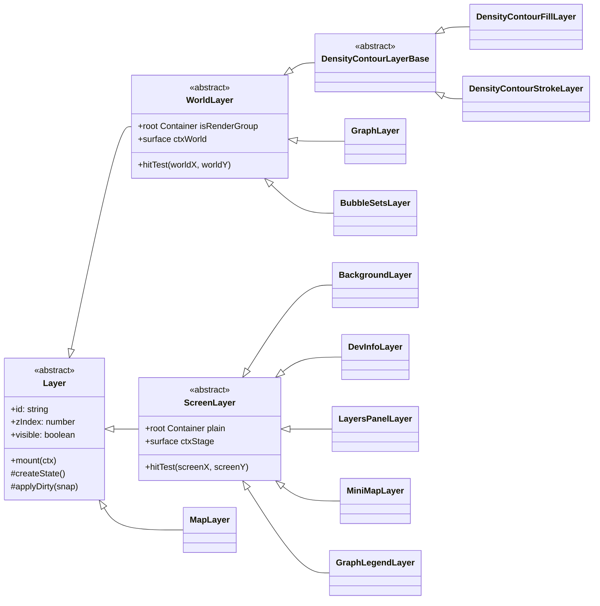
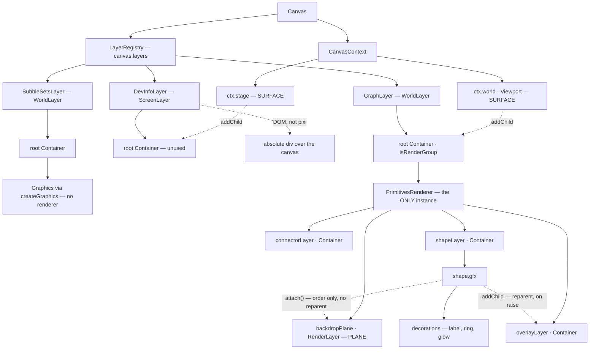
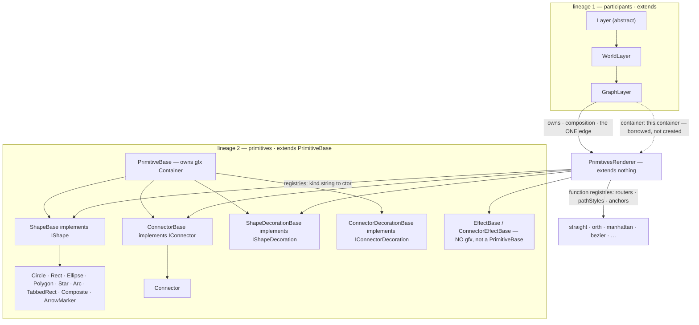
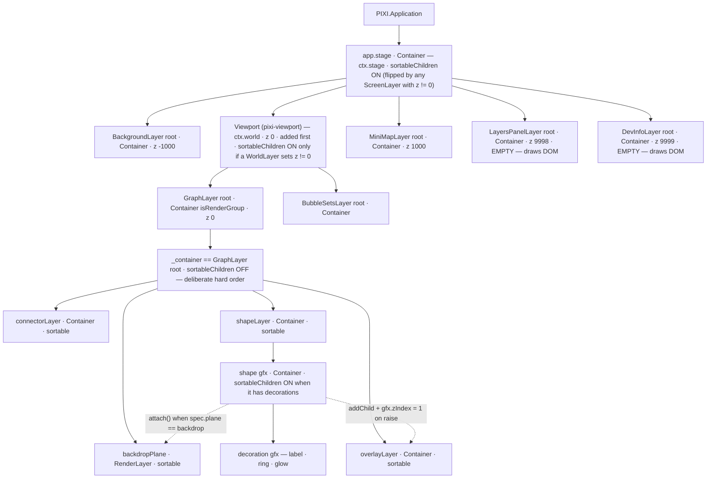
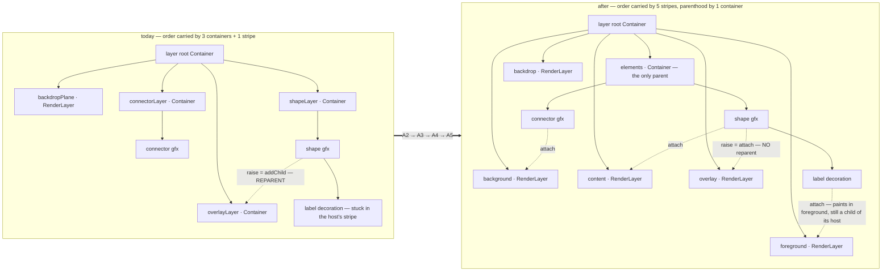

| | |
|---|---|
| **Ask** | Can `sym:DevInfoLayer` show the panes / the renderer's internal layers inside each `sym:Layer`? |
| **Answer** | Yes, but nothing exposes that structure today — the four paint containers are `private readonly` and `sym:Layer` holds no reference to a renderer. Additive seam required |
| **Second ask** | Make the existing vocabulary legible — "layer", "pane", "pixi layer", "RenderLayer" name six different things (§2.2 is the census) |
| **Root constraint** | A generic pixi walk cannot substitute for the seam: a `RenderLayer` holds **no children**, so the backdrop plane reads as empty and its members read as still-in-`shapeLayer` (R1) |
| **Stripe reality** | 5 stripes specced, **1** exists as a real object (`backdrop`); `content` is the absence of an attachment, `foreground` does not exist, `overlay` is still a reparent — §2.4 |
| **Lineage** | §2.5 — mermaid: the `sym:Layer` inheritance tree across 5 packages, and the runtime ownership chain surface → layer → renderer → plane → primitive |
| **Refactor inventory** | §9 (informational, own RFC per D7) — of 12 `Container` sites, **3 convert** to stripes, **2 are new**, **8 must stay**. Blocked on K1: `pickZ` does not exist |
| **Defect found while writing** | `sym:LayersPanelLayer` writes the non-emitting `visible` setter and never subscribes to `scene:layer:visibilitychange`, so its checkboxes drift (F7) |
| **Open decisions** | D1 vocabulary (`pane` vs `plane`) · D2 which overlay hosts the tree · D3 seam shape · D4 whether plane toggles are in scope |
| **Second inspector** | pixi devtools shows the tree as anonymous `Container` rows (§2.7) — and proves `deco:${constructor.name}` is already broken in built output (F12) |
| **Row status** | proposed 9 · accepted 0 · implemented 4 (F10–F13) · landed 0 · deferred 1 (F6) · rejected 0 |

---

## 1. Motivation

| ID | Observation | Where | Evidence |
|---|---|---|---|
| M1 | Six distinct things are called "layer"; there is no document that lists them side by side | repo-wide | §2.2 census |
| M2 | `sym:DevInfoLayer` reports camera / bounds / pointer / frame timing but nothing about scene *structure* | `file:packages/canvas/src/layers/DevInfoLayer.ts#L320-L361` | the `lines` array has no scene section |
| M3 | `sym:LayersPanelLayer` lists layers one row deep — `id · class · z · visibility` — and stops there | `file:packages/canvas/src/layers/LayersPanelLayer.ts#L259-L300` | rows are built from `ctx.layers.list()` only |
| M4 | "Is my group frame actually in the backdrop plane?" is unanswerable at runtime without a debugger | `file:packages/graph/src/layer/GraphLayer.ts#L1497-L1540` | the `plane` decision is computed per element and never surfaced |
| M5 | The plane axis is mid-migration — 2 of 5 stripes exist — so the gap widens as the rest land | `file:packages/canvas/src/primitives/types.ts#L402` | `PlaneName = 'backdrop' \| 'content'` vs five in the plan |
| M6 | `sym:LayersPanelLayer` declares no `kind` and ships no editor, unlike every sibling layer | `file:packages/canvas/src/layers/LayersPanelLayer.ts#L86` | root `CLAUDE.md` rule 12; `file:packages/canvas-ui/src/editors/layers/` has no `layers-panel-layer/` |

### Ruled out

| ID | Hypothesis | Verdict | Evidence |
|---|---|---|---|
| R1 | An overlay can just walk `ctx.stage` / `ctx.world` children and print the tree — no new API | **rejected** | `sym:RenderLayer` is ordering metadata that holds no children (`attach()` does not reparent, `file:packages/canvas/src/primitives/PrimitivesRenderer.ts#L361-L366`). A walk would print `backdrop` as empty and show group frames as ordinary `shapeLayer` children — i.e. it would show the logical tree while the screen shows the paint order, which is exactly the thing being debugged |
| R2 | `sym:DevInfoLayer` can reach the renderer through the layer it inspects | **rejected** | `sym:ILayer` exposes `id · visible · hittable · zIndex · cullable · mounted` and lifecycle only (`file:packages/canvas/src/layers/Layer.ts#L42-L56`); the base `sym:Layer` has no renderer field. Renderers are constructed privately by subclasses in `onMount` |
| R3 | `sym:LayersViewPanel` in `pkg:@invana/canvas-ui` already does this | **rejected** | It expands a layer into its **data** (node/edge types, element counts, per-element visibility) via `pkg:@invana/graph` store APIs — `file:packages/canvas-ui/src/view-panels/layers/LayersViewPanel.tsx#L1-L24`. Never touches paint structure, and by its own rules can't (no `@invana/canvas` value imports) |
| R4 | Reading the four containers is just a matter of loosening `private` | **partly** | It is necessary but not sufficient — the useful readout is derived (attached-vs-child counts, stripe order, which mechanism), and `pkg:@invana/canvas` must not hand raw pixi objects to consumers (`packages/canvas/CLAUDE.md`: "PixiJS is internal — never re-exported") |
| R5 | Per-plane visibility checkboxes are the obvious win | **rejected as specced** | `stripe.visible = false` provably does nothing for a `RenderLayer` — visibility flows through the logical parent chain, and `RenderLayer.collectRenderables` carries no display-status guard (`doc:docs/render-planes-and-emphasis-plan.md` §4.1.2). Only detach/re-add works, and that route is an unverified gate (plan D7). See F6 |

---

## 2. Design

### 2.1 The render tree as built today

```
app.stage                            ctx.stage      file:packages/canvas/src/context/CanvasContext.ts#L74
├── Viewport                         ctx.world      #L66   ← camera transform lives here
│   └── Container(isRenderGroup)      = WorldLayer root, label = layer.id
│       ├── RenderLayer 'backdrop'    backdropPlane  ← attach-only, holds no children
│       ├── Container                 connectorLayer   sortableChildren
│       ├── Container                 shapeLayer       sortableChildren
│       └── Container                 overlayLayer     sortableChildren, raised set
└── Container                         = ScreenLayer root (sibling of world, plain Container)
```

| ID | Step | Mechanism | Evidence | Consequence |
|---|---|---|---|---|
| S1 | A `sym:Layer` picks a **surface** at mount | `sym:WorldLayer` attaches its root to `ctx.world`; `sym:ScreenLayer` attaches to `ctx.stage` as a sibling | `file:packages/canvas/src/layers/WorldLayer.ts#L61-L69` · `file:packages/canvas/src/layers/ScreenLayer.ts#L59-L68` | Surface = camera-affected or not. There is no screen wrapper container — screen roots are stage children ordered after `world` |
| S2 | The world root is a **RenderGroup**, the screen root is not | `new Container({ isRenderGroup: true })` vs `new Container()` | `file:packages/canvas/src/layers/WorldLayer.ts#L61` · `file:packages/canvas/src/layers/ScreenLayer.ts#L7-L9` | RenderGroup is a **GPU batching boundary**, not an ordering concept. Nothing in the engine reads it; it is a perf flag |
| S3 | Layer order among peers is `Layer.zIndex`, applied lazily | Setting a non-zero `zIndex` flips the *parent* into `sortableChildren` | `file:packages/canvas/src/layers/WorldLayer.ts#L63-L66` · `file:packages/canvas/src/registries/LayerRegistry.ts#L112` | Two parallel orderings must stay in sync: pixi child order (paint) and `byZOrder()` (iteration, SVG export) |
| S4 | Inside a renderer-backed layer, paint order is **insertion order of three containers** | `connectorLayer` → `shapeLayer` → `overlayLayer`, and `_container` is deliberately *not* sortable | `file:packages/canvas/src/primitives/PrimitivesRenderer.ts#L434-L457` | A hard ordering: every connector under every shape. The only escape is `setRaised`, which **reparents** into `overlayLayer` (`#L837-L862`) |
| S5 | One stripe escapes that model — `backdrop` | A pixi `sym:RenderLayer`: `attach()` changes render order without reparenting; the shape stays a `shapeLayer` child | `file:packages/canvas/src/primitives/PrimitivesRenderer.ts#L357-L373` · `#L648-L649` | Transform, culling, decorations and destroy paths are untouched — the reason it beat the reparenting design in `doc:docs/group-frame-paint-band-plan.md` |
| S6 | The domain chooses the stripe per element | `GraphLayer` sets `plane: 'backdrop'` for an expanded, behind-children group frame, else `'content'` | `file:packages/graph/src/layer/GraphLayer.ts#L1497-L1540` | The engine's stripes are domain-free names; `pkg:@invana/graph` assigns meaning (plan §4.0) |
| S7 | Nothing in that chain is readable from outside | Four fields `private readonly`; `sym:ILayer` has no renderer; pixi types are never re-exported | `file:packages/canvas/src/primitives/PrimitivesRenderer.ts#L336-L373` · `file:packages/canvas/src/layers/Layer.ts#L42-L56` | **The gap.** Both dev overlays can see layers, and only layers |

### 2.2 Everything called "layer" — the census

The answer to "the terminologies are confusing": they are, and this is why.

| # | Name in code | What it actually is | Type | Where | Ordering role |
|---|---|---|---|---|---|
| 1 | `sym:Layer` / `sym:WorldLayer` / `sym:ScreenLayer` | An **engine participant** — lifecycle, dirty batching, hit-test, its own event emitter. The thing `canvas.layers` registers | engine class | `file:packages/canvas/src/layers/Layer.ts#L78` | `Layer.zIndex` orders layers against each other |
| 2 | **surface** (`ctx.world`, `ctx.stage`) | The two roots a layer can attach to — camera-affected vs screen-fixed | pixi `Container` / `Viewport` | `file:packages/canvas/src/context/CanvasContext.ts#L59-L74` | `world` first, screen roots after ⇒ screen always above world |
| 3 | layer **root container** | The pixi node a layer owns; what `createGraphics()` / `createContainer()` parent into | `Container` (world: RenderGroup) | `file:packages/canvas/src/layers/WorldLayer.ts#L61` | child order within its surface |
| 4 | `connectorLayer` · `shapeLayer` · `overlayLayer` | **Sub-containers inside one layer.** Named "…Layer" but *not* `Layer`s — they hold no state, no events, no lifecycle | `Container` | `file:packages/canvas/src/primitives/PrimitivesRenderer.ts#L345-L356` | insertion order = paint order; `sortableChildren` sorts *within* each |
| 5 | `backdropPlane` / pixi `sym:RenderLayer` | A **paint stripe**: render-order metadata. Holds no children, has no alpha/tint, `addChild` throws | `RenderLayer` | `file:packages/canvas/src/primitives/PrimitivesRenderer.ts#L373` | paints below `connectorLayer`, regardless of logical parent |
| 6 | `plane` (`sym:PlaneName`) | The **spec field** naming which stripe an element paints in — the public form of #5 | `'backdrop' \| 'content'` | `file:packages/canvas/src/primitives/types.ts#L387-L420` | coarse; beats `zIndex` |
| 7 | `spec.zIndex` | Fine ordering **within** a stripe / sub-container | number | renderer, hit index, `GraphLayer` | fine |
| 8 | CSS `z-index` | DOM chrome stacking — the two dev overlays are HTML `<div>`s, not pixi | CSS | `file:packages/canvas/src/layers/DevInfoLayer.ts#L266` | unrelated |
| 9 | RenderGroup (`isRenderGroup`) | GPU batch boundary. Frequently mistaken for an ordering concept | pixi flag | `file:packages/canvas/src/layers/WorldLayer.ts#L61` | none |

Two collisions do most of the damage: **#1 vs #4** (`shapeLayer` is not a `Layer`) and **#5 vs #4** (a `RenderLayer` is not a container). `doc:docs/render-planes-and-emphasis-plan.md` §4.1.3 catalogues the same problem on the `zIndex` axis — four unrelated meanings across 166 uses.

**"Pane" appears nowhere in the codebase** (`grep -rniI pane packages/canvas/src` → only `Panel` / `panel`). It is a free word, which is why D1 exists.

### 2.3 What the overlays would show

| ID | Surface | Readout | Cost |
|---|---|---|---|
| P1 | `sym:LayersPanelLayer` | Each layer row expands: surface (`world`/`screen`) · RenderGroup? · then one row per plane/sub-container with mechanism, child count, attached count, sorted flag | one traversal per re-render, event-driven (not per frame) |
| P2 | `sym:DevInfoLayer` | One compact `Scene` section: `layers 4/6 vis · shapes 812 · connectors 1204 · backdrop 3` — counters only, no tree | folds into the existing 500 ms repaint bucket |

The split follows the shape of each overlay: `sym:DevInfoLayer` is a fixed-height numeric HUD repainting on camera / pointer / FPS bucket; `sym:LayersPanelLayer` already owns variable-height rows, delegated input, and add/remove subscriptions.

### 2.4 Specced vs implemented — stripe by stripe

`doc:docs/render-planes-and-emphasis-plan.md` §4.0 specs five stripes. One exists as a real object.

| Stripe | Specced as | Implemented today | Mechanism | Evidence |
|---|---|---|---|---|
| `backdrop` | `RenderLayer`, below connectors | ✅ **yes** — the only one | `attach()` / `detach()`, unconditional detach, no reparent | `file:packages/canvas/src/primitives/PrimitivesRenderer.ts#L373` · `#L645-L649` |
| `background` (connectors) | `RenderLayer` | ❌ a plain `Container` | membership fixed at add time by `addChild` | `#L345` · `#L998` |
| `content` (shapes) | `RenderLayer` | ⚠️ **named but not an object** — `'content'` is the *absence* of an attachment | `addChild` into `shapeLayer` | `file:packages/canvas/src/primitives/types.ts#L402` · `PrimitivesRenderer.ts#L596` · `rfc:fix-2026-08-05-group-frame-occludes-edges` N2 |
| `foreground` (labels) | `RenderLayer` — labels paint above nodes while still following their host | ❌ **does not exist** | labels mount with `surface: shape.gfx`, i.e. transform-children of the host, so they paint inside the host's stripe | `PrimitivesRenderer.ts#L1260` · `file:packages/canvas/src/primitives/decorations/shape/LabelDecoration.ts#L210` |
| `overlay` (raised set) | `RenderLayer` | ❌ a `Container` **plus a reparent** | `setLifted` moves the gfx; a backdrop shape must leave its stripe on the way up and rejoin on the way down | `PrimitivesRenderer.ts#L845-L869` |

`foreground` is the load-bearing absence: `attach()` is the only mechanism that can paint a
label above every node *while* keeping it a transform-child of its host. Reparenting cannot
— the label would need world coordinates re-synced on every host move (plan §4.1.2).

#### Corrections to the design of record

| ID | Plan says | Actually | Evidence |
|---|---|---|---|
| C1 | `OVERLAY_SHAPE_Z = 1_000_000` / `OVERLAY_CONNECTOR_Z = 0` are "stripes hand-rolled as `zIndex` bands" (§4.1.3) | The magic strides are **gone**; `setLifted` uses plain `1` (shape) / `0` (connector) | `file:packages/canvas/src/primitives/PrimitivesRenderer.ts#L858` |
| C2 | Five stripes owned per `Layer` (D4) | One stripe object, owned per **renderer** | `#L451-L452` |
| C3 | — | Only **one** `sym:PrimitivesRenderer` is constructed in the whole repo, so planes exist only inside `sym:GraphLayer`. Every other layer paints straight into its root container via `createGraphics()` | `file:packages/graph/src/layer/GraphLayer.ts#L338` |

C3 shrinks F3 to a single call site, and means the panel must render "no planes" honestly
for `sym:BubbleSetsLayer`, `sym:DensityContourFillLayer`, `sym:MiniMapLayer` etc. rather
than implying a renderer that isn't there.

### 2.5 Lineage — classes and ownership

**Inheritance.** Every layer descends from one abstract `sym:Layer`; the surface choice is
the first branch.



| Class | Package | File |
|---|---|---|
| `sym:Layer` · `sym:WorldLayer` · `sym:ScreenLayer` | `pkg:@invana/canvas` | `file:packages/canvas/src/layers/Layer.ts#L78` · `WorldLayer.ts#L30` · `ScreenLayer.ts#L29` |
| `sym:BackgroundLayer` · `sym:DevInfoLayer` · `sym:LayersPanelLayer` | `pkg:@invana/canvas` | `file:packages/canvas/src/layers/BackgroundLayer.ts#L141` · `DevInfoLayer.ts#L86` · `LayersPanelLayer.ts#L86` |
| `sym:GraphLayer` · `sym:MiniMapLayer` · `sym:GraphLegendLayer` | `pkg:@invana/graph` | `file:packages/graph/src/layer/GraphLayer.ts#L138` · `MiniMapLayer.ts#L170` · `GraphLegendLayer.ts#L348` |
| `sym:BubbleSetsLayer` | `pkg:@invana/graph-layer-bubble-sets` | `file:packages/graph-layer-bubble-sets/src/BubbleSetsLayer.ts#L40` |
| `sym:DensityContourLayerBase` + 2 | `pkg:@invana/graph-layer-d3-contour` | `file:packages/graph-layer-d3-contour/src/DensityContourLayerBase.ts#L44` |
| `sym:MapLayer` | `pkg:@invana/graph-layer-maplibre` | `file:packages/graph-layer-maplibre/src/MapLayer.ts#L77` — **extends `sym:Layer` directly**, neither surface |

**Ownership at runtime.** Inheritance stops at the layer; everything below it is
composition, and that is where the vocabulary of §2.2 lives.



Read the two dotted edges out of `shape.gfx` together: they are the whole §2.1 story. One
changes paint order and leaves the object where it is; the other moves it. The panel
proposed in P1 exists to make that pair observable.

**Where `sym:PrimitivesRenderer` sits.** Nowhere in the `sym:Layer` tree — it extends
nothing (`file:packages/canvas/src/primitives/PrimitivesRenderer.ts#L250`) and is reached
only by composition. It is the root of a **second lineage**, and the two meet at exactly one
edge: a layer hands the renderer its own root container.



| Question | Answer | Evidence |
|---|---|---|
| Is it a `sym:Layer`? | **No.** No `mount`/`unmount`, no dirty batcher, no registry entry, never in `canvas.layers` | `#L250`; `packages/canvas/CLAUDE.md` — *"Used by Layers; never added to `canvas.layers`"* |
| Does it own a container? | **No — it borrows one.** `container: this.container` is passed in; the four paint objects are created *inside* it | `file:packages/graph/src/layer/GraphLayer.ts#L338-L339` · `PrimitivesRenderer.ts#L423` |
| What does it own? | The paint objects (§2.1), the primitive **registries** (`kind` → ctor / fn), the hit index, and the pointer router | `#L463-L481` · `#L541-L549` |
| Are markers their own lineage? | **No** — registered through the *shape* registry so a connector can resolve one by `kind` | `#L472-L475` |
| Are effects `sym:PrimitiveBase`s? | **No** — an effect has no `gfx`; it contributes transform/style deltas the renderer composes onto the host | `file:packages/canvas/src/primitives/base/EffectBase.ts#L28` |
| Naming drift | `packages/canvas/CLAUDE.md` calls it **`ShapesRenderer`**; the class is `PrimitivesRenderer` and **no alias is exported** — same family of confusion as §2.2 | `grep ShapesRenderer packages/canvas/src` → docs only |

So the inspector's traversal is: `canvas.layers` (lineage 1) → per layer, *optionally* one
renderer (composition) → its planes (§2.1) → per-element primitives (lineage 2). F2's
`declareRenderer` is precisely the missing edge between the two lineages.

**The pixi objects themselves**, with the real `zIndex` values the built-in layers ship:



Every pixi ordering knob in play, and what each one actually orders:

| Knob | Set at | Orders | Note |
|---|---|---|---|
| `stage.sortableChildren` | `file:packages/canvas/src/layers/ScreenLayer.ts#L63` — lazily, only when a screen layer has `zIndex != 0` | screen-layer roots **and** the viewport against each other | `sym:BackgroundLayer` (`z -1000`) is what flips it on in practice |
| `stage.addChild(world)` | `file:packages/canvas/src/engine/Canvas.ts#L1131` | the viewport's tie-break position (z 0, added first) | Sort is stable ⇒ a screen layer left at `z 0` still lands above world |
| `Layer.zIndex` → `root.zIndex` | `file:packages/canvas/src/layers/Layer.ts#L151` (default `0`), mirrored in `WorldLayer.ts#L63` / `ScreenLayer.ts#L61` | layer against layer | Shipped values: background `-1000` · graph `0` · minimap & legend `1000` · layers-panel `9998` · dev-info `9999` |
| `world.sortableChildren` | `file:packages/canvas/src/layers/WorldLayer.ts#L65` — same lazy flip | world-layer roots | Stays **off** while every world layer sits at `z 0` |
| `isRenderGroup: true` | `file:packages/canvas/src/layers/WorldLayer.ts#L61` | **nothing** — GPU batch boundary | Also the `renderGroup` scope a `RenderLayer` may not cross (K2) |
| `_container.sortableChildren` | never set — **deliberately off** | — | This is what makes connectors-under-shapes unbreakable except by leaving the container |
| `connectorLayer` / `shapeLayer` / `overlayLayer` `.sortableChildren` | `file:packages/canvas/src/primitives/PrimitivesRenderer.ts#L443-L446` | elements **within** one container, by `spec.zIndex` | Confined per container, so the 3-way order survives |
| `new RenderLayer({ sortableChildren: true })` | `#L451` | nested frames **within** the backdrop stripe | Frame depth push-back (`baseZ - 1`) still works inside it |
| `gfx.zIndex = 1 \| 0` | `#L858` (`setLifted`) | raised shapes above raised connectors | The old million-strides are gone (C1) |
| `shape.gfx.sortableChildren` | `#L1249` (shapes) · `#L1277` (connectors) | decorations within one host | A fourth, per-element sorting scope |
| `gfx.renderable` | `#L762` (`cull`) | **nothing** — visibility, not order | Culling is per element, orthogonal to planes |
| CSS `z-index: 9999 / 9998` | `file:packages/canvas/src/layers/DevInfoLayer.ts#L266` | the two DOM overlays against page chrome | Unrelated to pixi |

Two things this makes concrete. **`sortableChildren` is flipped lazily, in five separate
scopes** — stage, world, each of the three paint containers, the backdrop stripe, and each
host `gfx` — so "what does `zIndex` order here?" has a different answer at every depth.
And **the two dev overlays hold pixi containers they never draw into**: they carry
`zIndex` 9999/9998 on empty `Container`s while all their pixels are DOM
(`DevInfoLayer.ts#L9-L12`) — harmless, but a good example of why the readout in F4 should
report `childCount`, not just names.

### 2.6 Confirming test

| Test | Action | Result | Inference |
|---|---|---|---|
| T1 | `grep -rn "new Container()" packages/canvas/src` | 4 renderer/layer sites, all private | The tree is exactly as drawn in §2.1 — no hidden nesting |
| T2 | Read `sym:ILayer` | no renderer, no container, no plane accessor | R2 confirmed: the seam must be added, not merely exposed |
| T3 | Read `collectRenderablesMixin` analysis in the plan (§4.1.2) | `globalDisplayStatus` inherits from the **logical** parent; `RenderLayer` overrides collection without a display guard | R5 confirmed: stripe `.visible` is inert |
| T4 | Read `sym:Layer.visible` setter vs `sym:Layer.setVisible` | setter mutates silently (`#L116-L120`); only `setVisible` emits `scene:layer:visibilitychange` (`#L135`) | F7: the panel's checkbox uses the silent path, and its `refresh()` TSDoc ("the engine does not emit an event for visibility mutations") is stale |

### 2.7 The other inspector — pixi devtools, and what it shows today

Evidence: two devtools scene-tree captures of a running graph canvas. Every row below is
read off them.

| Devtools row | What it actually is | Named? | Evidence |
|---|---|---|---|
| `Container (Stage)` | `app.stage` | ❌ | no `label` assignment in `file:packages/canvas/src/engine/Canvas.ts` |
| `background (Container)` | `sym:BackgroundLayer` root | ✅ layer id | `file:packages/canvas/src/layers/ScreenLayer.ts#L60` |
| `Graphics (Graphics)` · `TilingSprite (TilingSprite2)` | the background's solid fill and its pattern tile | ❌ | `file:packages/canvas/src/layers/BackgroundLayer.ts#L317` |
| `world (it)` | the `Viewport` | ✅ label — but **`it` is the minified class name** | `file:packages/canvas/src/engine/Canvas.ts#L1125` |
| `graph (Container)` | `sym:GraphLayer` root | ✅ layer id | `file:packages/canvas/src/layers/WorldLayer.ts#L62` |
| `RenderLayer2` | `backdropPlane` — the one stripe | ❌ (and `2` is mangling, not a count) | `file:packages/canvas/src/primitives/PrimitivesRenderer.ts#L451` |
| `Container` × 3 | `connectorLayer` · `shapeLayer` · `overlayLayer` | ❌ | `#L434-L445` |
| `Container` × N | every shape / connector gfx | ❌ | `file:packages/canvas/src/primitives/base/PrimitiveBase.ts#L15` |
| `lasso-select-overlay` · `brush-select-overlay` | behaviour overlays | ✅ | `createContainer(label)` — `file:packages/canvas/src/layers/WorldLayer.ts#L104` |
| `Graphics (Graphics)` under those | the lasso path / brush rect | ❌ | — |

**The bug this exposes.** `world (it)` and `RenderLayer2` are mangled class names, so the
build under inspection is minified — which means the decoration labels
`deco:${this.constructor.name}` (`file:packages/canvas/src/primitives/base/ShapeDecorationBase.ts#L23`
· `ConnectorDecorationBase.ts#L24`) already resolve to `deco:t`-style noise in any built
output. Same failure mode root `CLAUDE.md` rule 12 introduced `kind` to prevent; the
decoration registry key is the stable string that should be used instead.

#### The four children of `graph`, and why two look empty

Devtools shows `graph (Container)` with exactly four children — `RenderLayer2`, `+ Container`,
`+ Container`, `Container`. Both childless ones are **expected**, for two completely
different reasons, and that is precisely why they need names.

| Row | Is | Children | Why it looks like that |
|---|---|---|---|
| `RenderLayer2` | `backdropPlane` | **structurally none, ever** | `addChild` throws on a `RenderLayer`; attached frames stay logical children of `shapeLayer`. Even with 3 group frames attached it renders empty here — the devtools tree is the *logical* tree (R1) |
| `+ Container` #1 | `connectorLayer` | one per edge | added first ⇒ paints below shapes |
| `+ Container` #2 | `shapeLayer` | one per node | — |
| `Container` (no `+`) | `overlayLayer` | **none right now** | Empty until something is raised. Hover a node and it gains a child; unhover and it empties again (`#L845-L869`) |

"Empty because it can't hold anything" and "empty because nothing is hovered" are the two
states a developer most needs told apart, and today both render as an anonymous
`Container`.

#### Proposed scheme — structural

| Object | Label | Allocation |
|---|---|---|
| `app.stage` | `stage` | constant |
| `Viewport` | `world` | ✅ exists |
| layer root | `layer.id` — e.g. `graph`, `background` | ✅ exists |
| `backdropPlane` | `plane:backdrop` | 4 constants |
| `connectorLayer` · `shapeLayer` · `overlayLayer` | `paint:connectors` · `paint:shapes` · `paint:overlay` | per renderer |
| layer-owned graphics | `background:solid` · `background:pattern` · `lasso:path` · `brush:rect` | constants |

#### Proposed scheme — per element

Every object below already exists; none is created for naming. Node and edge roots take the
**bare element id**, so the whole per-element scheme allocates nothing new.

```
paint:shapes                       Container
└── <node-id>                      Container   ← PrimitiveBase.gfx · sortableChildren
    ├── body                       Graphics    ← ShapeBase.bodyGfx · silhouette + fill + BORDER, zIndex 0
    ├── clip-mask                  Graphics    ← CompositeShape only
    ├── inset:<part kind>          Container   ← composite part ✅ already named
    │   ├── inset:glyph            Text        ← icon character
    │   └── inset:fill             Graphics
    └── deco:<kind>                Container   ← one per decoration
        ├── label:content          Container   ✅ already named
        │   ├── label:bg           Graphics    ✅ already named
        │   └── label:text         Text/HTMLText
        ├── ring:band              Graphics
        ├── frame:border           Graphics    ← SelectionFrameDecoration
        ├── frame:handles          Graphics
        ├── toggle:button          Graphics    · toggle:glyph  Graphics
        ├── liquid:mask            Graphics    · liquid:fluid Container → liquid:wave · liquid:highlight
        ├── ants:path              Graphics    ← MarchingAnts
        ├── glow:ring-<i>          Graphics    ← Glow / PulseRing rings
        └── resize:handle          Graphics

paint:connectors                   Container
└── <edge-id>                      Container   ← ConnectorBase.gfx
    ├── path                       Graphics    ← bodyGfx · the routed stroke
    ├── marker:source              Graphics
    ├── marker:target              Graphics
    └── deco:<kind>                Container
        ├── label:content → label:bg · label:text
        ├── ants:path · reveal:mask · ring:band
        ├── flow:particle-<i>      Graphics    ← FlowParticles
        └── fly:marker             Graphics
```

| Site | File | Proposed label |
|---|---|---|
| `PrimitiveBase.gfx` | `file:packages/canvas/src/primitives/base/PrimitiveBase.ts#L15` | element id (set by the renderer on add) |
| `ShapeBase.bodyGfx` | `file:packages/canvas/src/primitives/base/ShapeBase.ts#L61` | `body` |
| `ConnectorBase.bodyGfx` · `sourceMarkerGfx` · `targetMarkerGfx` | `file:packages/canvas/src/primitives/base/ConnectorBase.ts#L49-L51` | `path` · `marker:source` · `marker:target` |
| `CompositeShape.clipMask` | `file:packages/canvas/src/primitives/shapes/CompositeShape.ts#L352` | `clip-mask` |
| composite part views | `file:packages/canvas/src/primitives/paint/insetContentLayer.ts#L64` · `#L117` · `#L123` | ✅ `inset:<kind>` exists; name the `Text` / `Graphics` children |
| label text | `file:packages/canvas/src/primitives/paint/labelContent.ts#L29` · `#L34` | `label:text` |
| 24 decoration graphics | `primitives/decorations/{shape,connector}/*.ts` | per the tree above |

Using the bare id for element roots is what makes this free at graph scale — the string
already exists in `shapeInstances`; the label is a second pointer to it.

**This does not replace F4/F5.** Devtools needs the extension installed and shows the
*logical* tree, so it renders the backdrop stripe as an empty `RenderLayer` with its members
still under `shapeLayer` (R1). The two readouts are complementary: devtools for
"what object is this", the panel for "what paints where".

---

## 3. Prior art

| Doc | Relation | Status | What survives |
|---|---|---|---|
| `doc:docs/render-planes-and-emphasis-plan.md` | design of record for planes | proposed; **planes half stands**, emphasis half superseded | The five-stripe vocabulary, the `RenderLayer` verification (§3.1), the `.visible` finding (§4.1.2), the `plane` vs `zIndex` litmus (§4.1.3). This RFC **must not** hardcode two planes. **Three of its statements are now stale** — see the corrections table in §2.4 (C1–C3) |
| `doc:docs/group-frame-paint-band-plan.md` | superseded by the above | superseded | Why reparenting lost to `attach()` — the reason a naive tree walk misleads (R1) |
| `rfc:fix-2026-08-05-group-frame-occludes-edges` | landed the `backdrop` plane | landed | The one live consumer of stripe routing; its behaviour is this RFC's control (V5) |
| `doc:docs/renderer-pixijs-extraction-plan.md` | relates-to | planned | Any introspection type must be pixi-free so it survives the renderer extraction |
| `doc:docs/ui-consolidation-plan.md` | relates-to | in progress | Editors land in `pkg:@invana/canvas-ui`, not `pkg:@invana/canvas-react` |

---

## 4. The fix

`Kind`: `capability` = new surface · `plumbing` = seam only, no pixels · `defect` = something already promised · `dressing` = presentation.

| ID | Kind | Status | File/target | Change | Effect | Risk | Depends on |
|---|---|---|---|---|---|---|---|
| F1 | plumbing | proposed | `file:packages/canvas/src/primitives/PrimitivesRenderer.ts` | Add `describePlanes(): readonly PlaneInfo[]` — `{ name, mechanism: 'container' \| 'render-layer', order, childCount, attachedCount, sortable }`. Pure read, no pixi types escape. Derived from the actual field list, so it grows as stripes land (M5) | The renderer becomes self-describing; containers stay `private` | low | — |
| F2 | plumbing | proposed | `file:packages/canvas/src/layers/Layer.ts` · `WorldLayer` · `ScreenLayer` | Add `describeRenderTree(): LayerRenderTree` — `{ id, className, surface: 'world' \| 'screen', isRenderGroup, zIndex, visible, childCount, planes: PlaneInfo[] }`. Base returns the root-container facts with `planes: []`; a `protected declareRenderer(r)` call in `onMount` fills `planes` | One line per renderer-backed layer instead of a per-layer `describe` implementation | med — new public type on `pkg:@invana/canvas` | F1, D3 |
| F3 | plumbing | proposed | `file:packages/graph/src/layer/GraphLayer.ts#L338` | Call `declareRenderer(this._renderer)` after construction in `onMount`. **One call site in the repo** (C3) | The one renderer-backed layer reports its stripes; every other layer honestly reports none | low | F2 |
| F4 | capability | proposed | `file:packages/canvas/src/layers/LayersPanelLayer.ts` | Expandable rows per P1, behind a new `showPlanes?: boolean` option (default `true`); rows built from `describeRenderTree()` | The tree becomes visible at runtime; no story or app change required to benefit | med — changes what an existing overlay looks like | F2 |
| F5 | capability | proposed | `file:packages/canvas/src/layers/DevInfoLayer.ts` | New `Scene` section per P2, behind `showScene?: boolean` (default `true`) | Counters answer "how much is on screen" without expanding anything | low | F2 |
| F6 | capability | **deferred** | `sym:LayersPanelLayer` | Per-plane visibility toggles | Would let a stripe be switched off live | **high** — `.visible` is inert on a `RenderLayer` (R5); only detach/re-add works and it must restore the exact child index or paint order silently changes | plan D7 gate must pass first |
| F7 | defect | proposed | `file:packages/canvas/src/layers/LayersPanelLayer.ts#L187-L199` | Subscribe to `scene:layer:visibilitychange`; write `layer.setVisible(...)` instead of `layer.visible = …`; correct the stale `refresh()` TSDoc | Checkboxes stop drifting when anything else toggles a layer; toggling from the panel now repaints + notifies the minimap | low | — |
| F8 | plumbing | proposed | `sym:LayersPanelLayer` · `file:packages/canvas-ui/src/editors/layers/` | Add `override readonly kind = 'layers-panel-layer'` + a `layers-panel-layer/` editor (`fields.ts` · `mapping.ts` · `LayersPanelLayerEditorPanel`); extend the `dev-info-layer` editor with `showScene` | Satisfies rule 12 (M6); both overlays become configurable from `sym:GraphCanvasApp` | low | F4, F5 |
| F9 | dressing | proposed | `apps/docs` concept guide | Publish §2.2 as a terminology page | Kills the ambiguity for the next reader | low — **needs explicit approval**, root `CLAUDE.md` restricts authoring in `apps/docs` | D5 |
| F10 | plumbing | **implemented** | `file:packages/canvas/src/engine/Canvas.ts` · `file:packages/canvas/src/primitives/PrimitivesRenderer.ts#L434-L452` | Label the structural objects: `stage`, `plane:backdrop`, `paint:connectors`, `paint:shapes`, `paint:overlay` (§2.7) | The devtools tree stops being five anonymous `Container` rows | low — 5 constant strings per canvas | — |
| F11 | plumbing | **implemented** | `PrimitivesRenderer.addShape` / `addConnector` · `ShapeBase.ts#L61` | Label each element gfx with **the element id verbatim** (an existing string ref, no allocation) and `bodyGfx` as `body`. Landed in the renderer's add path rather than `PrimitiveBase` — the primitive doesn't know its id | Every node/edge is findable by id in devtools *and* in the devtools search box | low — verify with V13 at 50k elements before calling it free | — |
| F12 | **defect** | **implemented** | `ShapeDecorationBase.ts` · `ConnectorDecorationBase.ts` · `PrimitivesRenderer.setDecoration` | Replace `deco:${this.constructor.name}` with the decoration's registry `kind`. Base classes now write a `'deco'` placeholder; the renderer overwrites it via a new guarded `labelDecoration()` helper — `IDecorationBase` promises no `gfx`, so a third-party decoration without one is left unlabelled rather than crashing | Decoration labels survive minification — they do not today (`world (it)`, `RenderLayer2` prove the build mangles class names) | low | — |
| F13 | plumbing | **implemented** | `ConnectorBase.ts#L49-L51` · `CompositeShape.ts#L352` · `labelContent.ts#L29-L34` · `insetContentLayer.ts#L117-L134` · 24 decoration files · `BackgroundLayer.ts#L310-L317` | Label every remaining engine-created display object per the per-element tree in §2.7 — `path`, `marker:source`, `marker:target`, `clip-mask`, `label:text`, `ring:band`, `frame:border`, `toggle:glyph`, `background:solid`, … | Borders, texts, markers, masks and composite parts are all identifiable in devtools | low — mechanical, ~30 files | F10 |
| F14 | dressing | proposed | `packages/canvas/CLAUDE.md` | Record the naming scheme as a rule so new primitives keep it | The scheme survives the next contributor | low | F10–F13 |

---

## 5. Blast radius

### Upstream — things this depends on

| ID | Dependency | Why it matters | Risk if it moves |
|---|---|---|---|
| U1 | `doc:docs/render-planes-and-emphasis-plan.md` (2 → 5 stripes) | The readout must be data-driven off the renderer's own list | Hardcoding two stripes makes the overlay lie the day `foreground` lands |
| U2 | pixi 8 `RenderLayer` semantics | `attachedCount` has no public accessor guarantee; may need to be tracked renderer-side rather than read off the object | If read off pixi internals, a pixi bump breaks the count |
| U3 | `sym:PrimitivesRenderer` construction order (`#L434-L457`) | `order` in `PlaneInfo` is that literal sequence | A reorder silently changes the displayed truth — acceptable, that *is* the truth |
| U4 | `doc:docs/renderer-pixijs-extraction-plan.md` | `PlaneInfo` must stay a plain data type | A pixi-typed field would have to be re-cut during extraction |

### Downstream — things that could break

| ID | Consumer | Kind | Impact | Action required |
|---|---|---|---|---|
| D-1 | `file:packages/canvas-react/src/layers/DevInfoLayer.tsx` | React wrapper | New option must be forwarded, or `showScene` is unreachable from React | Add the prop |
| D-2 | `file:packages/canvas-ui/src/editors/layers/dev-info-layer/` (`fields.ts` · `mapping.ts` · `types.ts`) | editor | Options interface grows | F8 |
| D-3 | `file:packages/canvas-ui/src/toolbars/DevInfoToggleButton.tsx` · `file:packages/canvas-ui/src/apps/GraphCanvasApp.tsx` | UI | Overlay gets taller; the toggle semantics are unchanged | Visual check only |
| D-4 | `file:apps/storybook/stories/canvas/Conncepts/Layers/DevInfoLayer.stories.ts` · `…/LayersPanelLayer.stories.ts` | stories | Snapshots of overlay appearance change | No code change (rule 10 — do not add stories) |
| D-5 | `file:packages/canvas-ui/src/view-panels/layers/LayersViewPanel.tsx` | UI | Two "layers browsers" now exist with different depth axes (data vs paint) | Decide whether they converge later; **do not** duplicate the paint tree there in this RFC |
| D-6 | Published API of `pkg:@invana/canvas` | types | `PlaneInfo`, `LayerRenderTree`, `Layer.describeRenderTree`, `declareRenderer` become public | Export + TSDoc; they are additive, no break |
| D-7 | `pkg:@invana/graph` layers owning a renderer (`sym:GraphLayer`, `sym:MiniMapLayer` if applicable) | engine | Layers that skip `declareRenderer` report `planes: []` | Audit every `new PrimitivesRenderer` site |
| D-8 | Serialised state | none | No option is persisted beyond the two new booleans | — |

---

## 6. Verification

| ID | Status | Check | Target | Expected | Covers |
|---|---|---|---|---|---|
| V1 | **pass** | `pnpm check-types` | repo | clean — 17/17 tasks | F1–F8, F10–F13 |
| V1a | **pass** | `pnpm lint` | repo | 0 errors (49 pre-existing warnings, all in `apps/storybook`) | F10–F13 |
| V1b | note | — | — | Getting V1 green needed an **unrelated** pre-existing fix: `@invana/styling@0.0.19` maps `./themes.config` at raw un-compiled `.ts`, `@invana/themes`' `.d.ts` imports it, so `tsc` checked the dependency's own source and hit its `noUncheckedIndexedAccess` slip at line 114 (`skipLibCheck` can't suppress a `.ts`). Fixed by the pattern already in `file:apps/storybook/tsconfig.json` — a `paths` redirect to a local declaration stub — replicated into `pkg:@invana/canvas-ui` and `pkg:@invana/canvas-designer` | — |
| V2 | pending | Open `file:apps/storybook/stories/canvas/Conncepts/Layers/LayersPanelLayer.stories.ts`, expand the graph layer row | Storybook | Rows for `backdrop` (render-layer) · `connectorLayer` · `shapeLayer` · `overlayLayer` with non-zero counts | F1, F2, F4 |
| V3 | pending | Load a dataset with an expanded group frame; read the panel | Storybook | `backdrop` shows `attachedCount ≥ 1` while the frame still counts as a `shapeLayer` child — proving attach ≠ reparent | F1, F4 |
| V4 | pending | Hover a node with a raise behaviour enabled | Storybook | `overlayLayer` child count rises, `shapeLayer` falls (reparent), and the numbers return on unhover | F1, F5 |
| V5 | pending | **Control** — group frames still paint below the edges between their members | `story:` from `rfc:fix-2026-08-05-group-frame-occludes-edges` | Unchanged; introspection is read-only | F1–F5 |
| V6 | pending | **Control** — `sym:DevInfoLayer` FPS / frame-timing rows keep updating at the same cadence with the new section on | Storybook | No measurable change in reported `frame` / `cpu` | F5 |
| V7 | pending | Call `layer.setVisible(false)` from the console while the panel is open | Storybook | Checkbox updates without a manual `refresh()` | F7 |
| V8 | pending | Toggle from the panel checkbox | Storybook | Minimap and dependent layers react (they listen for `scene:layer:visibilitychange`) | F7 |
| V9 | pending | Expand a layer that owns no renderer — `sym:BubbleSetsLayer`, `sym:DensityContourFillLayer`, `sym:MiniMapLayer` | Storybook | Reads "no planes — paints directly into its root container", not an empty stripe list implying a renderer (C3) | F2, F4 |
| V10 | pending | Confirm the readout is derived, not hardcoded — temporarily add a stripe in the renderer | local | A new row appears with no panel change (U1) | F1, F4 |
| V11 | pending | Open pixi devtools on a graph story | Storybook | No anonymous `Container` / `Graphics` rows under `graph`; the four children read `plane:backdrop` · `paint:connectors` · `paint:shapes` · `paint:overlay`; nodes/edges read as their ids; a node expands to `body` + `deco:*` + `label:text` | F10, F11, F13 |
| V14 | pending | Hover a node, watch `paint:overlay`; then inspect `plane:backdrop` on a graph with group frames | devtools | Overlay gains/loses a child on hover; the backdrop stripe stays childless **by design** while its frames still list under `paint:shapes` — the two "empty" states are now distinguishable by name | F10 |
| V12 | **partial** | Repeat V11 against a **built** Storybook (`storybook-static`), not the dev server | built output | Names identical — proves nothing derives from `constructor.name`. **Static half done:** `grep` finds all four stripe names in the built `packages/canvas/dist/index.js`. The devtools eyeball is still pending | F12 |
| V13 | pending | Load a 50k-element dataset, compare heap + add time with labels on vs a local build with F11 reverted | Storybook | No measurable regression; if there is one, F11 gates behind a debug flag (D8) | F11 |

---

## 7. Decisions

| ID | Question | Options | Recommendation | Status |
|---|---|---|---|---|
| D1 | What do we call the stripes in the UI and the API — "pane" or "plane"? | (a) `plane`, matching `sym:PlaneName` and the design of record; (b) introduce `pane` for the readout | **(a) `plane`.** The census (§2.2) shows nine overlapping names already; a tenth synonym for a concept that has a settled one is the exact failure mode. Reserve `surface` for world/screen and `plane` for stripes | open |
| D2 | Where does the tree live? | (a) tree in `sym:LayersPanelLayer`, counters in `sym:DevInfoLayer`; (b) all of it in `sym:DevInfoLayer`; (c) a third overlay | **(a)** — matches each overlay's existing shape (§2.3); no new layer to register, name, and give an editor | open |
| D3 | Seam shape | (a) `declareRenderer()` on the base + one default `describeRenderTree()`; (b) each layer implements `describeRenderTree()` itself; (c) registry-side walk | **(a)** — one line per layer, one implementation to keep correct, and `pkg:@invana/graph` takes a one-line change instead of a per-layer method | open |
| D4 | Are plane toggles in scope? | (a) inspection only now, F6 deferred; (b) attempt detach/re-add now | **(a)** — the mechanism is unverified (plan D7) and getting the re-add index wrong changes paint order silently, which is worse than no toggle | open |
| D5 | Does §2.2 get published as a docs page (F9)? | (a) keep it in this RFC; (b) also publish under `apps/docs` guide | **(b), but only on your explicit yes** — root `CLAUDE.md` restricts authoring in `apps/docs`; this is a conceptual guide, which is the allowed exception | open |
| D6 | Does `sym:LayersViewPanel` eventually absorb this? | (a) leave both; (b) converge later; (c) converge now | **(b)** — it is engine-value-import-free by design (R3); converging now would break that rule for a dev-only readout | open |
| D8 | Are labels always on, or gated behind a debug flag? | (a) always on; (b) `debug: true` canvas option; (c) structural always, per-element gated | **(a)** — per-element labels reuse the id string, so the cost is one pointer per object, and a flag guarantees the tree is anonymous exactly when you are debugging a production build. Fall back to (c) only if V13 measures a regression | open |
| D7 | Does the `Container` → `RenderLayer` refactor (§9) land here? | (a) its own RFC, this one stays read-only; (b) fold the rows in | **(a)** — §9 changes paint order, picking, export and five behaviours; this RFC adds no observable behaviour. Landing the inspector *first* is also the cheapest way to verify the refactor (V2–V4 become its regression suite) | open |

---

## 8. History

| Date | Event | Status | Note |
|---|---|---|---|
| 2026-08-05 | Opened after asking whether `sym:DevInfoLayer` can show panes / per-layer renderer layers | proposed | Scope widened on request to document the existing layer / plane / `RenderLayer` vocabulary — §2.2 is that census |
| 2026-08-05 | Two findings recorded while writing | proposed | R5 (stripe `.visible` is inert → F6 deferred) and T4 (`visible` setter is silent → F7, a real defect in `sym:LayersPanelLayer`) |
| 2026-08-05 | Added §2.4 (specced vs implemented, C1–C3) and §2.5 (mermaid lineage — inheritance + runtime ownership) on request | proposed | Three staleness corrections to the design of record recorded; F3 narrowed to one call site by C3; V9/V10 added. Confirming test renumbered §2.4 → §2.6 |
| 2026-08-05 | Added §9 — the `Container` → `RenderLayer` refactor inventory, on request | proposed | **Informational, not in §4.** Every `new Container()` site classified; 3 convert, 1 is new, 8 must stay. Five blockers found, B1 (no `pickZ`) load-bearing. New decision D7 recommends this becomes its own RFC |
| 2026-08-05 | Placed `sym:PrimitivesRenderer` in §2.5 — a second lineage, not a `sym:Layer` | proposed | Extends nothing, borrows the layer's container, owns the registries. Recorded the `ShapesRenderer` naming drift in `packages/canvas/CLAUDE.md`. F2's `declareRenderer` is the one missing edge between the two lineages |
| 2026-08-05 | Added §2.7 + F10–F14 from two pixi-devtools screenshots | proposed | Naming census of the live scene tree. Found F12: `deco:${constructor.name}` is minification-unsafe, proven by `world (it)` / `RenderLayer2` in the same capture. New decision D8 on always-on vs gated labels |
| 2026-08-05 | **F10–F13 approved** ("start with F10-F13") | accepted | Naming only. F1–F9 + F14 untouched; F6 stays deferred |
| 2026-08-05 | F10–F13 implemented | implemented | 29 files across `pkg:@invana/canvas` + `pkg:@invana/graph`. `tsc --noEmit` clean in both; both build. **Two deviations from the written plan:** F11 labels in `addShape`/`addConnector` rather than `PrimitiveBase` (the primitive has no id), and F12 needed a guarded `labelDecoration()` helper because `IDecorationBase` doesn't declare `gfx` — a bare `deco.gfx` write failed to compile. V11/V13/V14 still need a devtools eyeball |
| 2026-08-05 | Unblocked repo-wide `check-types` | implemented | Pre-existing `@invana/styling` raw-`.ts` failure in `pkg:@invana/canvas-ui` + `pkg:@invana/canvas-designer`, unrelated to F10–F13; fixed with the storybook `paths`-stub pattern. Now **three** copies of that stub exist — folding it into `pkg:@repo/typescript-config` is the obvious follow-up, not taken unasked (V1b) |
| 2026-08-05 | Extended §2.7 with the full per-element naming tree — body/border, texts, markers, masks, composite parts, all 24 decorations | proposed | Third screenshot resolved the "two empty containers": `RenderLayer2` is childless **structurally**, `overlayLayer` is childless **situationally**. V14 added to assert both. F13 rescoped from "32 Graphics sites" to the named manifest |
| 2026-08-05 | Added the pixi-object lineage to §2.5 — stage · Viewport · containers · stripes, with shipped `zIndex` values and every ordering knob | proposed | Five separate lazily-flipped `sortableChildren` scopes catalogued; `_container` is deliberately never sortable. Noted the two DOM overlays hold empty pixi containers at z 9999/9998 ⇒ F4 must report `childCount`, not just names |

---

## 9. Appendix — which `Container`s become `RenderLayer`s

**Informational.** Nothing here is a fix row in §4; per D7 it wants its own RFC. Scope of the
census: every `new Container()` / `new RenderLayer()` in `pkg:@invana/canvas`.

### 9.1 The rule that decides each row

A `RenderLayer` **holds no children** — `addChild` throws — and has no transform, no alpha,
no tint, no filters, and an inert `.visible`. So:

> **Does anything need this object as a parent — for position, colour, or lifetime?**
> Yes → it stays a `Container`. No, it only answers *"what paints before what"* → it becomes a plane.

Every renderable therefore keeps **two** memberships: one logical parent (`addChild`) and one
stripe (`attach`).

### 9.2 The census

| ID | Object | File | Verdict | Why |
|---|---|---|---|---|
| A1 | `backdropPlane` | `file:packages/canvas/src/primitives/PrimitivesRenderer.ts#L373` | ✅ **already a plane** | Landed via `rfc:fix-2026-08-05-group-frame-occludes-edges` |
| A2 | `overlayLayer` | `#L356` | ➡️ **convert first** — highest value, lowest risk | It is pure ordering. Converting deletes the reparent in `setLifted` (`#L845-L869`) *and* the backdrop-vs-raise special case, because a raised backdrop shape would just claim a later stripe instead of having to leave its own |
| A3 | `connectorLayer` | `#L345` | ➡️ convert to `background`, **but keep a logical home** | Today it is both the ordering stripe and the parent of every connector gfx (`#L998`). Only the first role moves |
| A4 | `shapeLayer` | `#L347` | ➡️ convert to `content`, same split | Same double role (`#L596`). `'content'` currently means *unattached* (C2) — after this it means *attached to the content stripe*, which is the semantic change to watch |
| A5 | — | new | ➕ **new `foreground` stripe** | The point of the exercise: a label attaches to `foreground` while staying a transform-child of its host (`#L1260`). Reparenting can never do this |
| A6 | new `elements` container | new | ➕ **new logical parent** | Something must own the gfx once A3/A4 stop being homes. One container, no ordering meaning — or keep A3/A4 as bare homes (see 9.3) |
| B1 | `WorldLayer` root | `file:packages/canvas/src/layers/WorldLayer.ts#L61` | 🚫 stays | Carries the layer's transform; is the `renderGroup` boundary planes live inside |
| B2 | `ScreenLayer` root | `file:packages/canvas/src/layers/ScreenLayer.ts#L59` | 🚫 stays | Parent of screen content |
| B3 | `PrimitiveBase.gfx` | `file:packages/canvas/src/primitives/base/PrimitiveBase.ts#L15` | 🚫 stays | Every shape / connector / decoration root — transform + lifetime + `destroy({children:true})` |
| B4 | `LabelDecoration.contentLayer` | `file:packages/canvas/src/primitives/decorations/shape/LabelDecoration.ts#L76` | 🚫 stays | Holds bg + text as children, positioned as a unit |
| B5 | `LabelConnectorDecoration.contentLayer` | `file:packages/canvas/src/primitives/decorations/connector/LabelConnectorDecoration.ts#L56` | 🚫 stays | Same |
| B6 | `LiquidFillDecoration.fluidContainer` | `file:packages/canvas/src/primitives/decorations/shape/LiquidFillDecoration.ts#L75` | 🚫 stays | Masked + animated — needs a real transform |
| B7 | `insetContentLayer` gfx | `file:packages/canvas/src/primitives/paint/insetContentLayer.ts#L64` | 🚫 stays | Composite part content, inset inside a silhouette |
| B8 | `createContainer()` results — e.g. `sym:BubbleSetsLayer.labels` | `file:packages/canvas/src/layers/WorldLayer.ts#L102` · `file:packages/graph-layer-bubble-sets/src/BubbleSetsLayer.ts#L89` | 🚫 stays | Public layer-author API; authors expect a parent they can add to |

**Net: 3 convert (A2–A4), 2 new (A5–A6), 8 stay.** All of it inside
`sym:PrimitivesRenderer` — no layer subclass and no domain package changes shape, because
C3 says only `sym:GraphLayer` owns a renderer at all.

### 9.3 Before / after



The two things that change meaning: **paint order stops being scene-graph order** (every
renderable must be attached or it falls below all stripes — enforce on add), and
**raising stops being a move**.

### 9.4 Blockers — what must be true before A2–A5 land

| ID | Blocker | Evidence | Consequence if ignored |
|---|---|---|---|
| K1 | **`pickZ` does not exist.** Plane-aware picking is specced (plan §4.3) but `grep -rn pickZ packages/canvas/src` → **0 hits**; hit order is the spec `zIndex` recorded at insert | `file:packages/canvas/src/primitives/PrimitivesRenderer.ts#L589` | Paint order and pick order diverge the moment a stripe reorders anything — the user sees a label on top and clicks the node under it. **The load-bearing blocker** |
| K2 | **One `renderGroup`.** A `RenderLayer` and its children must share one; the world root sets `isRenderGroup: true`, but this is unvalidated under the `pixi-viewport` camera | plan §3.2, §8.1 | Silent mis-render, not an exception |
| K3 | **Stripe `.visible` is inert** (R5) — and A2–A5 multiply the temptation to use it | plan §4.1.2 | A "hide the foreground" control that does nothing |
| K4 | **SVG export knows nothing about planes** — `grep plane` in `file:packages/canvas/src/export/svgExport.ts` → 0 hits; it walks layers in z-order and serialises specs | `#L495` | Export order drifts from screen order. ⚠️ May **already** be wrong for `backdrop` today — verify before assuming this is new |
| K5 | **Filters do not cross the seam** — an ancestor's filter does not apply to a child attached elsewhere | plan §3.2 | Any future filter-based effect silently skips attached elements |

K1 is why A2 (`overlay`) is the recommended first move: raising already reorders paint
without touching the hit index, so converting it changes no picking behaviour that isn't
already the case. A3–A5 should wait for `pickZ`.

### 9.5 What this buys

| Gain | Enabled by |
|---|---|
| Labels above every node while still following their host | A5 |
| `setLifted` loses its reparent, and `applyShapePlane`'s "leave the stripe on the way up" special case disappears | A2 |
| One uniform mechanism — `setPlane(id, name)` — instead of "reparent for raise, attach for backdrop, addChild for everything else" | A2–A4 |
| O(1) whole-category LOD (all labels off at low zoom) — **if** the plan's D7 detach/re-add gate passes | A5 + K3 |
| The inspector in §4 becomes a flat, honest list: five stripes, five counts | A2–A5 |
